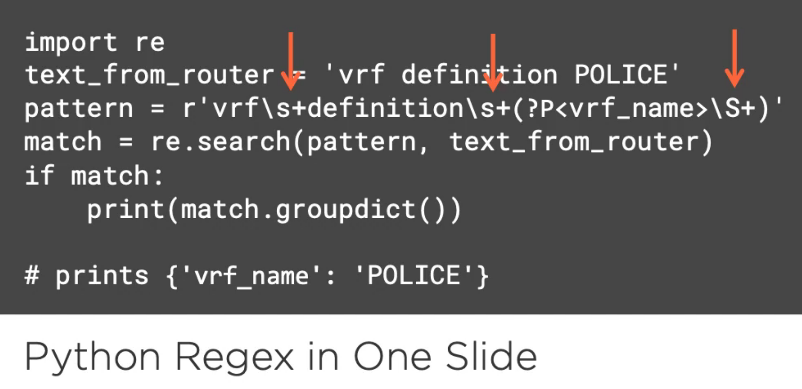

# Automating Networks with Python
## Nick Russo

# Re-Orienting Python for Network Applications
- You will want to know the basic python types before starting.
- **Multiprotocol Label Switching (MPLS)** is a complex networking protocol.
- We're going to simulate where we have two separate entities which should not be able to see each other's traffic:

- **Route Targets** determine who is in your your vpn and who is not.
- This allows anyone to create arbitrary networking topology by importing and exporting these targets.
- We're going to be using the pyton package **Paramiko** for this stuff.
- In a sentence, it enables python to interface with SSHv2.
- It was designed to be low level and is closer a swiss army knife.
- Here is some clinet example code:
```python
import paramiko
conn_params = paramiko.SSHClient()
conn_params.connect(
  hostname = "R1",
  username="turltes",
  password="trutles",
)
```
- It makes no assumptions about what we're planning to do.
```python
conn = conn_params.invoke_shell()
conn.send("show ip interface brief\n")

# must specify the amount of bytes to read
output = conn.recv(65535)
```
- The first problem is how do you tell how long to wait for a response.
- **Inventory** is often used to describe the collection of managed networking devices.
- Always remember to close your connections with `conn.close()`.
- I already know how to write to a file in python.
- You can explicitely call for a breakpoint using `breakpoint()`; only works in 3.7.
  * You can use this in earlier version of python: `import pdb; pdb.set_trace()`.
- You can type `locals` in pdb to print out all local variables.


# Autmating Networks with Paramiko and Netmiko
- The core concepts of **Infrastructure as Code** are:
  1. State Declaration.
  2. Abstraction.
  3. Version Control.
- The term **Idempotent** means that a property defining an operation that can be executed many times and not make unnecessary changes after the initial setup.
- Version Control allows us to travel back in time.
- **Jinja2** is used as an intuitive text templating engine.
- Here is a real life example Jinja2 template:

- Let's explore **Netmiko** - which is built on top oc **Paramiko**.
- It comes with sane defaults and handles all the sending, collecting outputs.


# Responsibly Parsing Text Using Python
- We're stepping into how to deal with parsing text since this will come up.
- It's not enough to just write a parser; we should have a way to quickly test it.
- A **Regex** is a pattern of text to be searched in a larger text.

- Python regex uses `\s+` to collect any kind of whitespace; `\S+` means anything not whitespace.
- You can use `(?P<variable_name>\S+)` to collect from the the text an into variable `variable_name`.
- You will search the text with `<pattern-complied>.search(<text>)` and it will return a match object.
- If you get a match, then you can pull from the match object using the variable name declared as a key: `match.group("<variable_name>")`.
- It is a shame how little unit testing is done in code, per teacher.
- The advantage of doing this is any future changes will be tested for consistency.
- All functions that start with `test_` are considered tests to pytest.
- You can type `pytest .` to recursively call all tests.


# Abstracting Networking Automation Tasks with NAPALM
- We're going to now be talking about the package **NAPALM**.
- It stands for *Network Automation and Programming Abstraction Layer with Multilayer Support*.
- We'll import from the napalm package: `from napalm import get_network_driver`
```python
driver = get_network_driver(host["platform"])
conn = driver(
  hostname = host["name"], username="pyuser", password="pypass"
)
```
- Instead of issuing commands, *napalm* supports many getters.
- You can get basic information about the device using `conn.get_facts()`
- You can merge the two configs together using:
```python
conn.load_merge_candidate(config=<config-text>)
diff = conn.compare_config()
if diff:
    conn.commit_config()
```
- A Mathematical Set is an unsorted collection of unique elements.
- We're going to focus on just the simple parts we need from Set Theory.
- There are lots of other uses for *napalm*.
  - Config replace
  - Config rollback
  - Python context managers.


# Orchestrating Complex Processes with Nornir

# Advancing Beyond SSH: Automating with APIs

# Writing Production-Grade Python Code

# Research:
- NAPALM?

# Reference:
