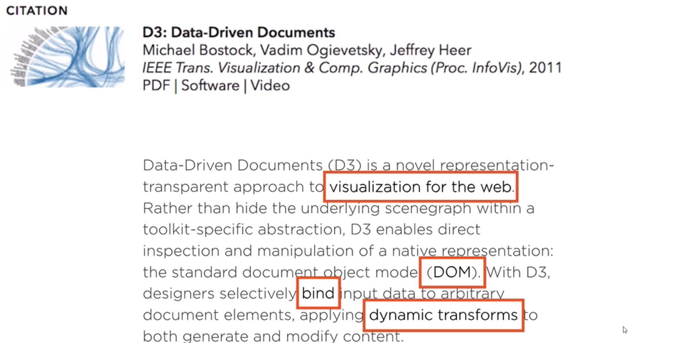
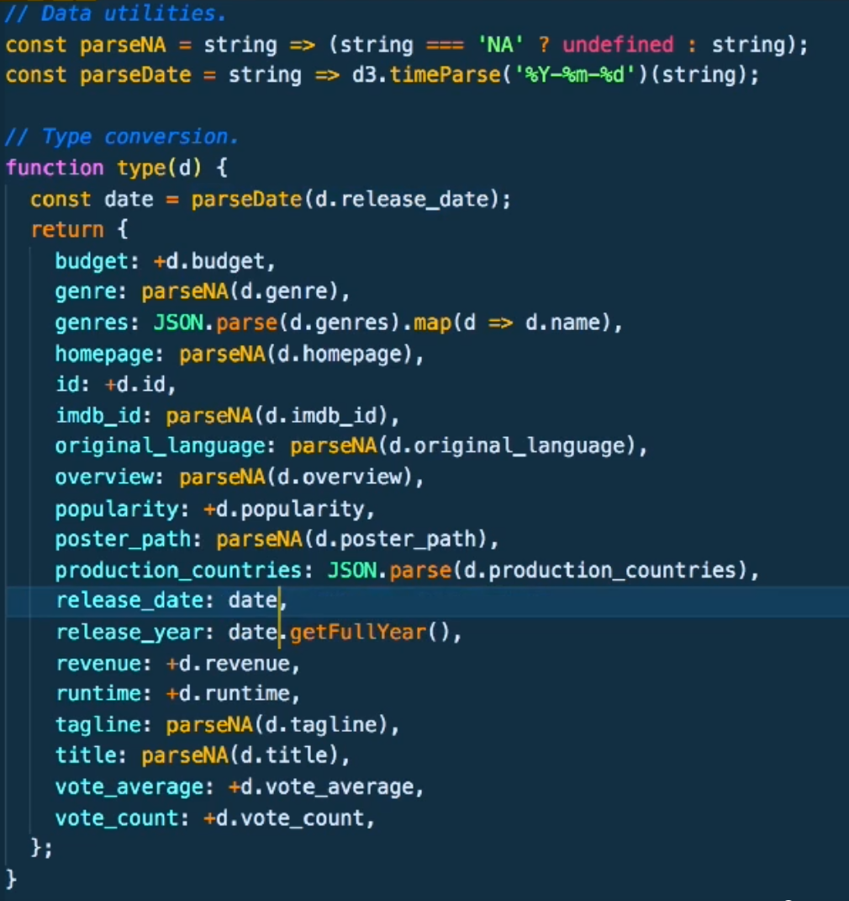

# D3.js Data Visualization Fundamentals
## Lars Versphohl

# Covering the Basics
- Of note, there is some skepticism about 3D visualizations in the field.
- **D3** stands for **Data Driven Documents**.
- *Data Drives the DOM*.
- It was born from the Stanford Vis Group in 2011.
- The primary creator credited is Mike Bostock.

- D3 is not a charting library, at root.
- You will need to design and built the parts to your own visualizations.
- The main technologies that will be used are:
  1. HTML
  2. Javascript.
  3. SVG.
  4. CSS
- It is now on version 5 and is split into convenient modules that you can load and use.
- The **Visualization Process**:
  1. Data Preparation.
  2. Data Join.
  3. Drawing.
  4. Interaction.
  5. Animation.
- Before you can draw to the screen, you need a **Renderer**.
- This is a technology to draw/render to the screen.
- There are three choices:
  1. HTML.
  2. SVG.
  3. canvas
- HTML is meh; SVG is useful; use canvas for lots of elements.
- It is harder to interact with *canvas*.
- *SVG* stands for **Scalable Vector Graphics**.
- They are mathematical functions underneath that are independent of scale.
- All we really need is an SVG element:
```html
<body>
  <svg width='500' height='300'>
    <line x1='100' y1='100' x2='300' y2='100' stroke='black' />
    <circle cx='300' cy='100' r='3' />
    <text x='100' y='90'>Lolli 1</text>
  </svg>
</body>
```
- The graph's origin is actually in the top left and not the bottom right.
- Another very useful element in SVG is the *grouping* or *g* element.
- It does two things:
  1. Helps with order.
  2. Helps with positioning groups of elments.
- g elements don't have x or y elements but they do have transform elements.
- You can use this to define elements across groups.
- There are three that you can use:
  1. Translate.
  2. Scale.
  3. Rotate.
```html
<body>
  <svg width='500' height='300'>
    <g transform='translate(100,100)'>
      <line x1='100' y1='100' x2='300' y2='100' stroke='black' />
      <circle cx='300' cy='100' r='3' />
      <text x='100' y='90'>Lolli 1</text>
    </g>
  </svg>

```
- g elements establish a new coordinate system for their children.
- You can actually remove the values which are 0 since those are the defaults.
- Normally, you wont be modifying SVG code while working with D3.
- You can add D3 using `<script src="//unpkg.com/d3"></script>`.
- Before we can do anything with elements, we need to turn them into D3 selections.
```js
const svg = d3.select('body') // allow to join things to the DOM
  .append('svg')
  .attr('width', 500)
  .attr('height', 300);

const lolli = svg.append('g').attr('transform', 'translate(100,100)');

lolli
  .apppend('line')
  .attr('x2', 200)
  .style('stroke', 'black')

lolli
  .append('circle')
  .attr('cx', '200')
  .attr('r', 3);

lolli
  .append('text')
  .attr('y', -10)
  .text('Lolli');
```


# Shaping the Data
- Data Visualization is an Iterative Process.
- We'll be getting our data from [The Movie DB](https://themoviedb.org/).
- We'll be using the module **D3-Fetch** to pull data into D3.
- You should use the documentation to figure out what each API can do.
- We will load the data using:
 ```js
 d3.csv('<path/to/data>.csv')
  .then(res => {
    console.log('Local csv:' res);
  });
```
- You can assign the load calls and trigger all of them at once using:
```js
Promise.call([potter, rings]).then(res => {
  console.log('Multiple requests :' res);
  console.log('Multiple requests concat:', [...res[0], ...res[1]]);
})
```
- The first task will be type conversion.
- You can declare the types of the columns by passing a second defined function called `type` to `d3.csv()`.

- After filtering it, we'll move to the visualizing.
- You really should do the cleaning outside of JS.
- We'll be using the function `d3.rollup( <data>, <reducer>, <key>)`.
- The *key* is the variable we want to group our data by.
- The *reducer* is a function that has access to the grouped array of subsets.
- In our case, we're trying to total up the sales per genre so we'll need one of D3's statistics functions.
- `d3.sum()` takes the subset along with an accessor key:
```js
function prepareBarChartData(data){
  const rolledUp = d3.rollup(
    data,
    v => d3.sum(v, leaf => leaf.revenue),
    d => d.genre
  )}
```
- This will return a map and D3 doesn't really like maps so we'll want to convert it into an array again.
- We do this with `dattaArray = Array.from(<target>, d => ({ genre: d[0], revenue: d[1]}));`
- Don't forget to sort it:
```js
cosnt barChartData = prepareBarChartData(moviesClean).sort((a,b) => {return d3.descending(a.revenue - b-revenue);});
```


# Drawing a Bar Chart With Data
- Now we're going to actually start drawing data.
- This is overall process that all of them are going to follow:
  1. Transform the Data.
  2. Chart Dimensions.
  3. Scales.
  4. Join and Draw.
  5. Axis.
  6. Refine
- In order to create this, we'll use the D3 Margin Convention set by Mike Bostock.
- We'll start by setting them all in a margins object:
```js
//margin convention:
const margin = { top: 40, right: 40, bottom: 40, left: 40};
const width = 400 - margin.left - margin.right;
const height = 500 - margin.top - margin.bottom;

//draw base
d3.select('.bar-chart-container')
  .append('svg')
  .attr('width', width + margin.left + margin.right)
  .attr('height', height + margin.top + margin.bottom)
  .append('g')
  .attr('transform', `translate(${margin.left}, ${margin.top})`);
```
- Scales map your data values to screenspace.
- In D3 lexicon, the **Data Domain** is your input values and your output values are called the **Output Range**.
- We will do this now:
```js
// use this to find the smallest,largest values:
const xExtent = d3.extent(barChartData, d => d.revenue);


const xScale = d3
  .scaleLinear()
  .domain(xExent)  // expects minimum and maximum values
  .range([0,width])     // expects minimum and maximum values

```
- You should really always start visualizations at 0 and can find the max value using `d3.max()`.
- You can use other scales as well - such as logarithmic.
- There are also color scales as well.
- We will definitely be using the **Band Scales** which map categorical values to pixel space.
```js
const yScale = d3
  .scaleBand()
  .domain(barChartData.map(d => d.genre))
  .rangeRound([0, height])   //this is cleaner for Visualizations.
```
- D3 Data Joins looks at the data, figures out what the units are and binds the data values to the visual elements.
- We can also update the data and D3 will diff the old and new data.
- Only D3 selections give you access to the methods to join data to elements.
```js
svg
  .selectAll('.bar')
  .data(barChartData) // must be an array
  .enter()            // happens to everything selected.
  .append('rect')     // type of elements
  .attr('class', 'bar')
  .attr('y', d => yScale(d.genre))
  .attr('width', d => xScale(d.revenue))
  .attr('height', yScale.bandwith())
  .style('fill', 'dodgerblue')

  // scales offer a padding you can add - which will be done here
  // yScale ... .paddingInner(0.25)
```
- Now we're going to build the axis.
- To build one, you need to know two things: the Position and the Scale.
```js
const xAxis = d3.axisTop(xScale)
const xAxisDraw = svg.append('g').attr('class', 'x axis')
  .call( xAxis ) // D3 will pass this as the first argument and is prefered.
```
- You can use `d3-format` to help with controlling what values look like - including axis values.
- Axis have a dedicated formatter called `.tickFormat()`.
```js
// Draw axis
const xAxis = d3
  .axisTop(xScale)
  .tickFormat(d3.format('~s'))
  .tickSizeInner(-height)
  .tickSizeOuter(0)

const xAxisDraw = svg
  .append('g')
  .attr('class', 'x axis')
  .call(xAxis)
```
- You can also modify the values with an external style sheet.
- Adding the Y axis is basically the same.
- Working with text is SVG is not as simple as working with it in HTML.


# Making a Scatter Plot and a Line Chart

# Updating Your Bar Chart Data

# Add Interactivity

# Working with Hierarchical Layouts.

# The Reusable Module Pattern

# Research:

# Reference:
- [D3-Fetch Github](https://github.com/d3/d3-fetch/)
- [Devdocs.io](https://devdocs.io)
- [D3 Margin Convention](https://bl.ocks.org/mbostock/3079563)
-
