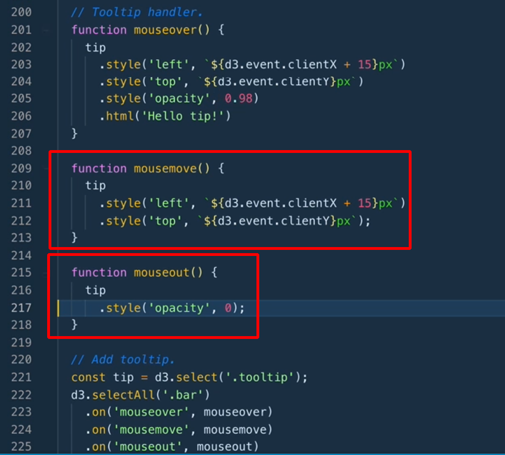

# D3.js Data Visualization Fundamentals
## Lars Versphohl

# Covering the Basics
- Of note, there is some skepticism about 3D visualizations in the field.
- **D3** stands for **Data Driven Documents**.
- *Data Drives the DOM*.
- It was born from the Stanford Vis Group in 2011.
- The primary creator credited is Mike Bostock.

- D3 is not a charting library, at root.
- You will need to design and built the parts to your own visualizations.
- The main technologies that will be used are:
  1. HTML
  2. Javascript.
  3. SVG.
  4. CSS
- It is now on version 5 and is split into convenient modules that you can load and use.
- The **Visualization Process**:
  1. Data Preparation.
  2. Data Join.
  3. Drawing.
  4. Interaction.
  5. Animation.
- Before you can draw to the screen, you need a **Renderer**.
- This is a technology to draw/render to the screen.
- There are three choices:
  1. HTML.
  2. SVG.
  3. canvas

- HTML is meh; SVG is useful; use canvas for lots of elements.
- It is harder to interact with *canvas*.
- *SVG* stands for **Scalable Vector Graphics**.
- They are mathematical functions underneath that are independent of scale.
- All we really need is an SVG element:
```html
<body>
  <svg width='500' height='300'>
    <line x1='100' y1='100' x2='300' y2='100' stroke='black' />
    <circle cx='300' cy='100' r='3' />
    <text x='100' y='90'>Lolli 1</text>
  </svg>
</body>
```
- The graph's origin is actually in the top left and not the bottom right.
- Another very useful element in SVG is the *grouping* or *g* element.
- It does two things:
  1. Helps with order.
  2. Helps with positioning groups of elments.
- g elements don't have x or y elements but they do have transform elements.
- You can use this to define elements across groups.
- There are three that you can use:
  1. Translate.
  2. Scale.
  3. Rotate.
```html
<body>
  <svg width='500' height='300'>
    <g transform='translate(100,100)'>
      <line x1='100' y1='100' x2='300' y2='100' stroke='black' />
      <circle cx='300' cy='100' r='3' />
      <text x='100' y='90'>Lolli 1</text>
    </g>
  </svg>

```
- g elements establish a new coordinate system for their children.
- You can actually remove the values which are 0 since those are the defaults.
- Normally, you wont be modifying SVG code while working with D3.
- You can add D3 using `<script src="//unpkg.com/d3"></script>`.
- Before we can do anything with elements, we need to turn them into D3 selections.
```js
const svg = d3.select('body') // allow to join things to the DOM
  .append('svg')
  .attr('width', 500)
  .attr('height', 300);

const lolli = svg.append('g').attr('transform', 'translate(100,100)');

lolli
  .apppend('line')
  .attr('x2', 200)
  .style('stroke', 'black')

lolli
  .append('circle')
  .attr('cx', '200')
  .attr('r', 3);

lolli
  .append('text')
  .attr('y', -10)
  .text('Lolli');
```


# Shaping the Data
- Data Visualization is an Iterative Process.
- We'll be getting our data from [The Movie DB](https://themoviedb.org/).
- We'll be using the module **D3-Fetch** to pull data into D3.
- You should use the documentation to figure out what each API can do.
- We will load the data using:
 ```js
 d3.csv('<path/to/data>.csv')
  .then(res => {
    console.log('Local csv:' res);
  });
```
- You can assign the load calls and trigger all of them at once using:
```js
Promise.call([potter, rings]).then(res => {
  console.log('Multiple requests :' res);
  console.log('Multiple requests concat:', [...res[0], ...res[1]]);
})
```
- The first task will be type conversion.
- You can declare the types of the columns by passing a second defined function called `type` to `d3.csv()`.

- After filtering it, we'll move to the visualizing.
- You really should do the cleaning outside of JS.
- We'll be using the function `d3.rollup( <data>, <reducer>, <key>)`.
- The *key* is the variable we want to group our data by.
- The *reducer* is a function that has access to the grouped array of subsets.
- In our case, we're trying to total up the sales per genre so we'll need one of D3's statistics functions.
- `d3.sum()` takes the subset along with an accessor key:
```js
function prepareBarChartData(data){
  const rolledUp = d3.rollup(
    data,
    v => d3.sum(v, leaf => leaf.revenue),
    d => d.genre
  )}
```
- This will return a map and D3 doesn't really like maps so we'll want to convert it into an array again.
- We do this with `dattaArray = Array.from(<target>, d => ({ genre: d[0], revenue: d[1]}));`
- Don't forget to sort it:
```js
cosnt barChartData = prepareBarChartData(moviesClean).sort((a,b) => {return d3.descending(a.revenue - b-revenue);});
```


# Drawing a Bar Chart With Data
- Now we're going to actually start drawing data.
- This is overall process that all of them are going to follow:
  1. Transform the Data.
  2. Chart Dimensions.
  3. Scales.
  4. Join and Draw.
  5. Axis.
  6. Refine
- In order to create this, we'll use the D3 Margin Convention set by Mike Bostock.
- We'll start by setting them all in a margins object:
```js
//margin convention:
const margin = { top: 40, right: 40, bottom: 40, left: 40};
const width = 400 - margin.left - margin.right;
const height = 500 - margin.top - margin.bottom;

//draw base
d3.select('.bar-chart-container')
  .append('svg')
  .attr('width', width + margin.left + margin.right)
  .attr('height', height + margin.top + margin.bottom)
  .append('g')
  .attr('transform', `translate(${margin.left}, ${margin.top})`);
```
- Scales map your data values to screenspace.
- In D3 lexicon, the **Data Domain** is your input values and your output values are called the **Output Range**.

- We will do this now:
```js
// use this to find the smallest,largest values:
const xExtent = d3.extent(barChartData, d => d.revenue);


const xScale = d3
  .scaleLinear()
  .domain(xExent)  // expects minimum and maximum values
  .range([0,width])     // expects minimum and maximum values

```
- You should really always start visualizations at 0 and can find the max value using `d3.max()`.
- You can use other scales as well - such as logarithmic.
- There are also color scales as well.
- We will definitely be using the **Band Scales** which map categorical values to pixel space.
```js
const yScale = d3
  .scaleBand()
  .domain(barChartData.map(d => d.genre))
  .rangeRound([0, height])   //this is cleaner for Visualizations.
```
- D3 Data Joins looks at the data, figures out what the units are and binds the data values to the visual elements.
- We can also update the data and D3 will diff the old and new data.
- Only D3 selections give you access to the methods to join data to elements.
```js
svg
  .selectAll('.bar')
  .data(barChartData) // must be an array
  .enter()            // happens to everything selected.
  .append('rect')     // type of elements
  .attr('class', 'bar')
  .attr('y', d => yScale(d.genre))
  .attr('width', d => xScale(d.revenue))
  .attr('height', yScale.bandwith())
  .style('fill', 'dodgerblue')

  // scales offer a padding you can add - which will be done here
  // yScale ... .paddingInner(0.25)
```
- Now we're going to build the axis.
- To build one, you need to know two things: the Position and the Scale.
```js
const xAxis = d3.axisTop(xScale)
const xAxisDraw = svg.append('g').attr('class', 'x axis')
  .call( xAxis ) // D3 will pass this as the first argument and is prefered.
```
- You can use `d3-format` to help with controlling what values look like - including axis values.
- Axis have a dedicated formatter called `.tickFormat()`.
```js
// Draw axis
const xAxis = d3
  .axisTop(xScale)
  .tickFormat(d3.format('~s'))
  .tickSizeInner(-height)
  .tickSizeOuter(0)

const xAxisDraw = svg
  .append('g')
  .attr('class', 'x axis')
  .call(xAxis)
```
- You can also modify the values with an external style sheet.
- Adding the Y axis is basically the same.
- Working with text is SVG is not as simple as working with it in HTML.


# Making a Scatter Plot and a Line Chart
- Time to move to a scatterplot.
- The process is basically the same but we'll just be drawing with different functions.
- The y direction has an annoying issue were the data => pixel values is inverted.

- The reason for this is where D3 and SVG think of as the origin:


- And, here is the code:
```js
svg
  .selectAll('.scatter')
  .data(scatterData)
  .enter()
  .append('circle')
  .attr('class', 'scatter')
  .attr('cx', d => xScale(d.budget))
  .attr('cy', d => yScale(d.revenue))
  .attr('r', 3)
  .style('fill', 'dodgerblue')
  .style('fill-opacity', 0.7)
```
- We're just stealing the axis from the Bar chart at this point.
- When you use `.setTicks(<n>)`, it wont guarantee that number but it should be close.
- Line Charts are different than Scatter plots.

- An **SVG Path Definition** is described by many points, by necessity.

- Paths have a default fill color of black and will connect the last and first point together.


# Updating Your Data
- There is a **General Update Pattern** which allows you to keep updated data in sync with your visual elements on screen.
- There are three Data change states:
  1. Enter state: new data rows.
  2. Update state: remaining data rows.
  3. Exit State: leaving data rows.

- The main two services of data join are:
  1. Compares existing data to what is or isn't inside the DOM.
  2. Creates the three mentioned states.

- When you work with HTML5 Canvas or WebGL, there is no DOM and it will be raw pixels.
- You can use the HTML5 Data API for the buttons:

- Selections have an `.on()` method to listen for events.
- Then, after having a data array you can index into it:
```js
function click(){
  const dataset = friends[this.dataset.name]
}
```
- In D3v5, you can use the `.join()` method to work with each [update,exit,enter]:
```js
function update(data){
  svg
    .selectAll('text')
    .data(data)
    .join(
      enter => enter
        .apend('text')
        .text(d => d)
        .attr('x', 30)
        .attr('y', (d,i) => i * 30 + 50)
        .style('fill', 'dodgerblue'),
      update => update
        .style('fill', 'gray')
        .attr('y', (d,i) => i * 30 + 50),
      exit => exit.remove()
    )
}
```
- D3 is blind to the data row's content; it only sees the index by default.
- We can tell it what values we care about with the **Key Function** added to the `.data()` as a second argument.
```js
//
.selectAll('text')
.data(data, d => d)
.join(
  //
)
```
- Animated Transitions allow for **Object Constancy** which allow for better reasoning.
- It draws focus on what changes instead of trying to reason about those changes.
- D3 makes this simply by just adding `.transition()` to the method chain.
- You can also do things like delay the transition with `.delay()`:

- D3 will complain when you do this since it wants a D3 Selection returned.
- You can resolve this by updating the code to:
```js
//
.call(enter =>
  enter
    .transition()
    .attr('x', 30))
```


# Updating Your Bar Chart Data
- Some more examples building one the previous two sections.


# Add Interactivity
- We'll start by adding a table that only displays on hover.
- The first thing you can do is add a tooltip to the Div:
```html
<div class="tooltip"></div>
```
- You can use the clientX and clientY from `d3.event` object.



- When the user changes the bars, then the tablular data is not updated for the new data rows.
- Now we will add what is called a **Brush**.
- It is a D3 component that is part of an event system which monitors and interacts with users.
- It is only supported while using SVG though.
- You can add a brush like so:


# Working with Hierarchical Layouts.
- A **D3 Layout** is technically just a function that takes your data and adds additional variables to it.

- Trees have a root node with tree nodes hanging off of it.
- While this is useful, we're going to try building a **Circle Packing** graph.
- This allows you to vary the area to of the circle to represent a quantitative variable.
- The first step is to get the data into a hierarchy to visualize.
- The hierarchy is expected to be in a JOSN format when D3 uses it.
- We'll be using the *d3-heirarchy* package to do this.
- We need to tell D3 which values are for the id and for the parent.

- Each node has access to a sum function which can sum all of its children.

- Now we'll add the Pack Layout:

- Changing this data structure to from a circle to a tree map.
- Humans reason better with rectangular shapes than with circles.
- Some layouts however require different sorts so make sure to read the docs.

- Now we'll convert the data into an example of the most famous Hierarchical data visualization: the Tree.
- You can draw the lines using the targets source and targets:


# The Reusable Module Pattern
- Now we're going to build a Reusable Module Pattern.
- The **Reusable Charts** Convention was created by Mike Bostock.
- At its core, it's a function that builds a chart.
- When you're building this, you'll want the module to store the configs internally.
- **Closures** are simply functions in a function.


- There is another function called `.datum()` which is a little different than `.data()`.

- While you could use `selection.data()`, using `selection.each()` allows us to iterate.
- Here is the basic framework for any chart:


# Research:
- `live-server`?
- Force Layout Diagrams?


# Reference:
- [D3-Fetch Github](https://github.com/d3/d3-fetch/)
- [Devdocs.io](https://devdocs.io)
- [D3 Margin Convention](https://bl.ocks.org/mbostock/3079563)
- [D3-Ease Github](https://github.com/d3/d3-ease/)
