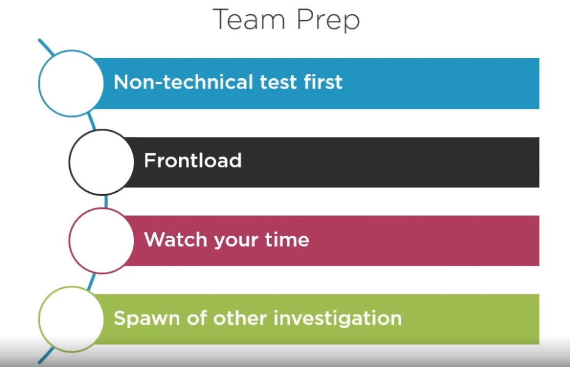
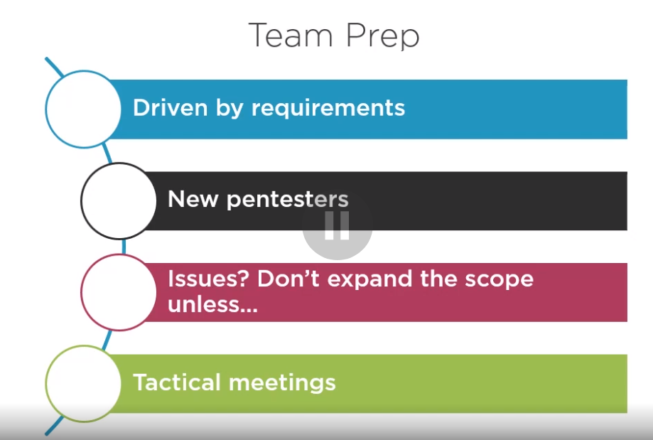
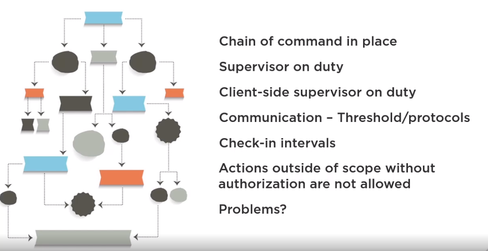

# Laying the Foundation for Penetration Testing for CompTIA PenTest+
## Dale Meredith

# Penetration Testing Foundations
- **Pentesting** is a way to think about your existing environment how an attacker would look at it.
- The two points we're interested in are:
  1. How they get in.
  2. What they found.
- *"If I can physically get to your device then you don't own it anymore."*
- There is a difference between **Vulnerability Assessment** and **Pentest**.
- With the *Vulnerability Assessment*, we're using mostly automated testing.
- With the *Pentest*, we're finding and executing on what is found to see if it works.
- **Red Team** means attackers; **Blue Team** means defenders.
- **Frameworks** are here for the layout or blueprint to work with.
- Frameworks:
  * CHECK from the UK Governemnt.
  * OWASP from the Open Web Application Security Project.
  * OSSTMM from the Open Source Security Testing Methedology Manual.
  * PTES from the Penetration Testing Exwcution Standard.
  * NIST SP 800-115 from the US National Institute of Standards and Technology.
- Phases of Pentesting:
  1. Planning.
  2. Reconnaissance.
  3. Scanning.
  4. Gaining Acccss.
  5. Maintaining Access.
  6. Cover your Tracks.
  7. Analysis.
  8. Reporting.
- Tools!
- **The Chain of Command** is who should know what.
- **Client Counterparts** should have a close relationship with the client and the Pentest team.
- Make sure you cover you bases with contracts.
  * NDAs.
  * Master Service Agreement.
  * Statement of Work.
- Who can authorize the pentest?
- Who is doing the pentest?
- Which hosts can be targets?
- Beware of Export Restrictions in some companies.
- Organizational Policies?
- National and Local Restrictions.

# Setting up a Lab Environment to Pentet
- You will need to reboot since Windows will put the OS right on top of the Hypervisor Interface.
- Now we're going to isolate them using the Virtual Switch Manager from Hyper-V.
- Each type of Virtual Switch is:
  * External: Can access the physical network adapter.
    - Expect to lose connectivity when this is applied.
  * Internal: Only be used by VMs running on this Virtual host and the host.
  * Private: Only be used by VMs running on the host.
- Alternatively, one could use VMWare instead of Hyper-V.
- Reminder that you cannot run both Hypervisors on the same machine.
- To manager the Virtual Switches in VMWare Workstation, you'd want to use *Edit* > *Virtual Networking Editor*.
- In **Bridge Mode**, it will get its own IP address like a real host on the network.
- In **NAT Mode** all the VMs will share a single IP that will be NAT'd by VMware.

# Adding Virtual Targets
- We're going to setup a few intentionally vulnerable devices:
  * Server 2016
  * Server 2019
  * Windows 10
  * OWASP-BWA
  * Metasploitable
- `sconfig` is a non-GUI way to configure Windows Machines.
- Visual Walk throughs of Multiple insecure targets.
- Make sure that you create a snapshot once everything is finished.

# Adding Your PenTest Workstation
- We're going to quick look over three tools:
  1. Kali Linux.
  2. Parrot
  3. BlackArch.
- The .OVA just a compressed file that can be opened.

# Planning You Engagment
- Before we actually engage, we need some planning steps.
- The types of systems you are permitted to go after is important.
- We need to know what users we're allowed to go after too.
- There are different kinds of PenTests:
  1. Black box: know nothing.
  2. Grey box: know something.
  3. White Box: Know everything about the network.
- You should have a bag that is dedicated to pentesting and nothing every leaves it unless on an attack.
- There are **Rules of Engement**:
  1. The timeline is known and shared will all stakeholders.
  2. Locations of the clients.
  3. Are there certain and times and dates will be off limits?
  4. Transparency about who is aware of the Pentest.

# Setting Your Limits with Scope
- You need to set out the **Goals and Deliverables** are.
- Is This Objective-Based or Compliance-Based.
- Is this a Red Team assessment?
- There are different kind of Threat Actors:
  1. Script Kidies.
  2. Hacktivists.
  3. Organized Crime.
  4. Nation States.
  5. Insider Threat.
- What kind of targets do we go after?:
  1. Internal Targets.
  2. On-Site
  3. Offsite.
  4. External.
  5. 1st Party Hosted.
  6. 3rd Party.
  7. Physical.
  8. SSIDs.
  9. Users.
  10. Applications.
  11. ICS/Embedded Systems.
  12. Real Time Operating Systems (RTOS's).
  13. Supervisory Control And Data Acquisition systems.
  14. Mobile.
  15. Point of Sale Systems.
  16. Biometrics.
  17. Application Containers.
- Companies deal with risk in different ways.
- One of those is to just outright avoid the risk.
- Another is **Transference** where they move the risk to a different provider.
- **Risk Mitigation** is when a company adds controls to the risk to limit it.
- The last one is **Acceptance** where the company is aware of but accepts it.

# The "Just Us League"
- We need prepare the client:
  * Make sure there is a point of contact.
  * Notify that the IT staff.
  * Confirms backups for target systems.
  * There should be no stepping up of Security; should be realistic.
  * Review scope and limits.
  * Known Objectives and Delliverables understood.
  * Document everything!
  * Make sure all Authorization is in place: in writing.

- For any pentest engagement, make sure you have an escalation path.

# Research:
* Nmap
* Nikto
* OpenVAS
* SQLMap
* Nessus
* John the Ripper
* Hashcat
* Medusa
* THC-Hydra
* Cewl
* Cain and Abel
* Mimikatz
* Patator
* Dirbuster
* WAAAF
* OLLYDBG
* Immunity Debugger
* GDB
* WinDBG
* IDA
* FindBugs and FindSecBugs ( JAVA, JAVA WEB)
* Peach
* AFL
* SonarQube
* YASCA
* Whois
* nslookup
* FOCA
* theHarrvester
* Shodan
* Maltego
* Recon-ng
* Censys
* Aircrack-ng
* Kismet
* WiFite
* Wifi-Pumpkin
* OWASP ZAP
* Burp Suite
* SET (Social Engineering Toolkit)
* BeEF (Browser Exploitation Framework)
* SSH
* Ncat
* Netcat
* Proxychains
* Wireshark
* hping
* Drozer.
* APKX
* APK Studio
* Powersploit
* Searchsploit
* Responder
* Impacket
* Empire
* Metasploit

# Reference:
- [Pentest Standard](http://www.pentest-standard.org)
- [Awesome Pentest](https://github.com/enaqx/awesome-pentest)
- [SANS](https://pen-testing.sans.org/resources/downloads)
- [Kitploit](https://www.kitploit.com)
- [Faraday Github](https://github.com/infobyte/faraday)
- [Process.st Collaboration Tool](https://process.st)
