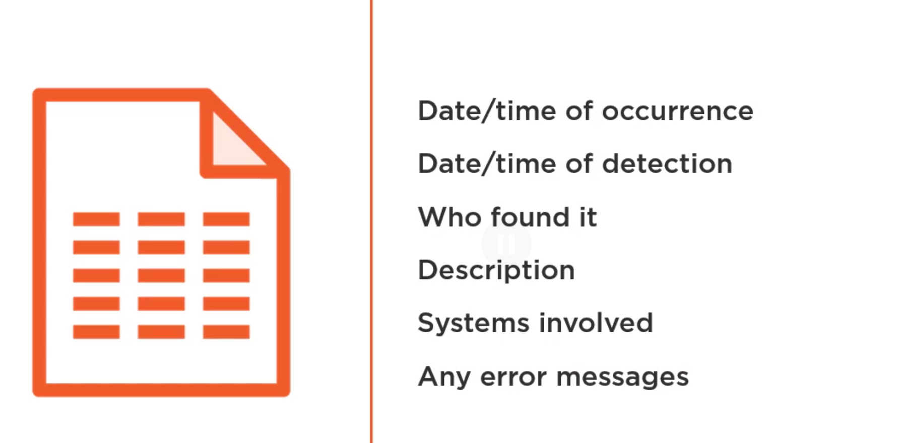
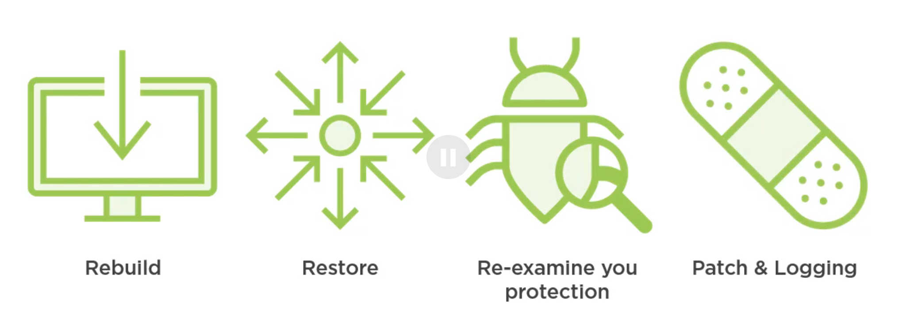
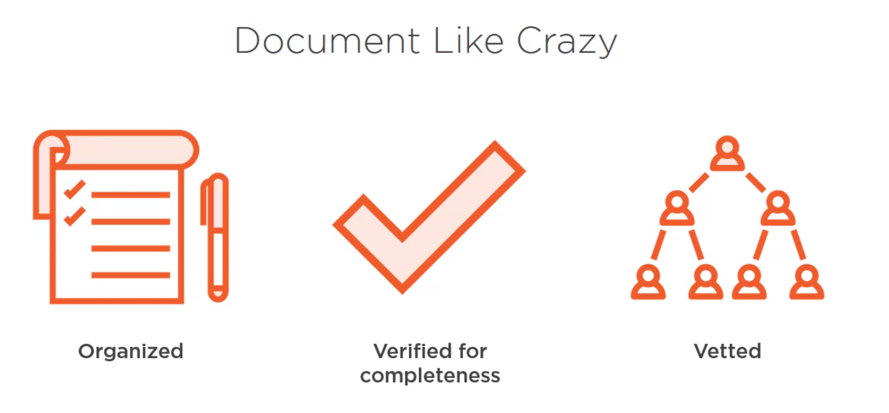
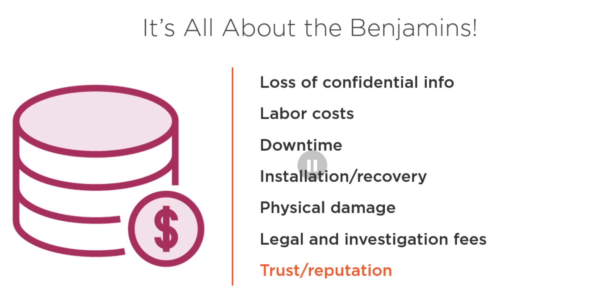
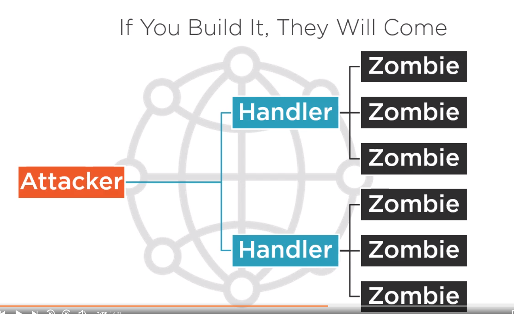

# Performing Incident Response and Handling
## Dale Meredith

# Preparing for Incident Response and Handling
- Like **Defensive Driving**, you're always thinking about a way out based on other's behaviors.
- The **Security Policies** are the basis for securing an organization's infrastructure.
- It provides a layer of protection for physical and information assets.
- What goals are desired for by upper management.
- They will also depict the basic architecture of the Companies Security Environment.
- They are also there to decrease or eliminate legal obligations for employees and/or third parties.
- They protect private information from theft, misuse, unauthorized uses, or modifications.
- It helps prevent waste of the company's computing assets.
- Here are the key elements:
  1. Clear Communication.
  2. Define the Scope.
  3. Enforceable by Law.
  4. Areas of Responsibility.
  5. Appropriate Direction; connected to other policies.
  6. Management Involvement.
- Here are the goals:
  1. Safe from inappropriate use or abuse.
  2. Availability of systems is current and up to date.
  3. Unauthorized modification of data.
- The Policies should include:
  1. Detailed Descriptions.
  2. Detailed info about the status.
  3. Concern of the Affected.
  4. Comparability within the Organization.
  5. Relevancy of the Policy.
- Always make sure everyone is aware of the policies.
- There must be a rotation of duties.
- Do Implementations after anything changes, added or removed.
- The **Access Control Policy** is meant to align users who are allowed to use something and map them to appropriate resources.
- We do this by defining what actions they're allowed to take.
- The **Acceptable Use Policy** is a set of rules about how resources should be used.
- The **Administrative Security Policies** are policies that describe what resources are necessary to achieve the risk and Business Continuity Objectives.
- It makes sure you're business's resources are properly managed.
- It also should detail the rights and responsibilities of personnel in handling security.
- The **Asset Contorl Policy** are guidelines about controlling and tracking assets.
- They should include some kind of tracking ID, or number.
- The **Audit Trail Policy** is designed to help us collect all audit trails.
- You'll be able to assign Accountability using these.
- It also helps us re-construct events.
- It can also help us collect Intrusion Detection.
- The **Logging Policy** helps us to set which set of system events need to be logged.
- We need to ensure that there are enough details to trace the event.
- It should also show what details should be retained.
- It should also include log review intervals.
- These are also important since they can assist with any kind of civil or legal issues that come up.
- The **Documentation Policy** is there to help us to determine the requirements,policies of your companies operations and resources.
- It should also include who is allowed to read,access,modify the network or server documentation.
- The **Evidence Collection Policy** is required if you want to provide a legal framework for collecting evidence due to a security incident.
- It should help us create and maintaining a **Chain of Custody**.
- The **Evidence Preservation Policy** is about how to maintain the data,evidence in a pristine state.
- This can include things like:
  1. Always having two copies.
  2. Backups.
  3. Detail as much as possible: time,dates,people handling, etc.
- The **Information Security Policy** are there to strengthen the security resources.
- Also there to help protect the reputation of the company.
- And, also to ensure the requirements are known to everyone.
- And, it also helps to create a framework for us.
- **National Information Assurance Certification and Accreditation Process(NIACAP)** establishes a set of standard national activities and general tasks to certify systems the security posture of a system.
- They're derived from multiple Government laws and directives.
- The **Physical Security Policies** are there for establishing rules for granting,removal to facilities.
- If you need to reach out about Digital Crimes, then you need someone inside the organization that reaches out.
- This will typically be handled by lawyers in your organization.
- Reporting the crime to the Government can fundamentally change how evidence is processed.
- There are a few agencies you should know about:
  1. Federal.
  2. District Attorney.
  3. State Law Enforcement.
  4. Local Law Enforcement.

- In reference to what can and cannot be done with **Search and Seizures**.
- Government agents require a Warrant to Search and Seizures.
- The Supreme Court has ruled there are two necessary conditions:
  1. It does not violate an individuals reasonable expectation of privacy.
  2. A warrantless search is reasonable if it falls within the expectations of a warrant's requirements.
- The 4th does not apply to searches conducted by private parties.

# Incident Response Process
- A **Computer Security Incident** is an event or events that threaten the security of your networking infrastructure.

- Digital Assets are also an essential commodity to how the business functions.

- While we wont dig into it here, Classification of assets is important.

- The common symptoms are of an Incident are:
  1. Weird Logs entries.
  2. IDS Alarm.
  3. Weird User Accounts.
  4. Suspicious Files/Extensions.
  5. Files/Folders modified.
  6. Unknown Services/Ports.
  7. System is "off"
  8. Harddrives/Icons not accessible.
  9. Massive Incoming Packets.
- There are three basic functions of handling these events:
  1. Reporting.
  2. Analysis.
  3. Response.
- The goal of all this is to inspect, control and stop future attacks like it.
- The Plan should include
  1. How info is communicated.
  2. Validation of the Incident.
  3. Containment and responce tactic.
  4. Restoration.
  5. Documentation.
  6. Preservation of Evidence.
  7. Who is responding?
  8. Roles and Duties of them.
  9. How it will be handled.
  10. Decision Making Process is also documented.
- Questions you may need to ask:
  * Do we involve the CSIRT Team?
  * Legal Strategies?
  * Support from Mangemenent?
  * Good Remediation Plan?
- **Information Warfare** is the conflict that makes use of information and information systems.
- A Few kinds of Information Warfare:
  1. Hijacking.
  2. Jamming.
  3. Disabling Networks.
  4. Spoofing.
- **Coinfidentiality** is prevention of unauthorized access.
- **Integrity** is the ability to trust the information given.
- **Availability** is the ability to access the resource.
- A **Precursor** indicates the probability or possibility of an incident.
- An **Indication** is signals or symptoms that lead you to think an incident occured.
- When incidents happen, they are sorted into the following categories:
  * **Low**:
    * Misuse of Systems.
    * Sharing Company Accounts.
    * Failure to Apply updates.
    * Not following AUP.
    * Failed Scans of the network.
    * Loss of Password.
    * Compromise a system password.
  * **Middle**:
    * Unfriendly employee being fired.
    * Access violation using a super user.
    * Unofficial storing and processing of data.
    * Damage of property related to computer incident.
    * Personal Theft of Data.
    * Malware outbreak.
    * Prohibited Access to buildings.
    * Breach of AUP.
  * **High**:
    * DoS Attacks.
    * Suspected break-in.
    * Presence of harmful programs.
    * Unauthorized changes to system.
    * Damage of Property exceeding $100K
    * Personal theft exceeding $100K.
    * Any kind of pornography, gambling, violation of law.
- Do not prioritize things as you get them; triage based on the category.
- Once it happens, you'll want to:
  1. Step by step responses.
  2. Recovery ASAP
  3. What lessons were learned?
  4. Prepare for Legal issues.
- **Incident Handling** refers to a set of procedures and policies used to prepare for, detect and overcome security incident for your organization.
- Report everything.
- The most well known and popular team is **Computer Emergency Response Team (CERT)**.
- Another is the **Computer Security Incident Response Team (CSIRT)**.
- Another is the **Forum for Incident Response and Security Teams (FIRST)**.
- Another is the **Security Emergency Response Team (SERT)**
- Another is the **Security Incident Response Team (SIRT)**
- Another is the **Information Analysis Infrastructure Protection (IAIP)**.
- ... and lots more.

# The Workflow of Incident Response
- The first steps is the Identification Step.
- Make sure to note the event properly.
- Type steps are:
  1. Able to validate.
  2. Identity the nature of the incident.
  3. ID and protect the evidence.
  4. Create reports.
- We can identify incidents using:
  * Anti-virus/IDS/Firewall Alert.
  * Unsuccessful login attempts.
  * Unexpected deletion or corruption of data.
  * System Crashes.
  * Audit logs.
- There are actions that you will need to follow through with:
  1. Analyze Audit logs.
  2. Start the Incident Reporting Process.
  3. Collecting and protecting the system information.
  4. Incident Severity Category Identification.
  5. Gather Other System logs analysis.
  6. Assign a Task Force Member.
- Next is the **Incident Recording** which is recording the incident someplace safe and accurate.

- Make sure you know what immediately happens when you start responding to a potential incident.
- The next step is **Communicating** that the incident took place.
- After which, you will want to move to **Containment**.
- If this is due to a service, disable it!
- If this is due to an unknown attack vector, remove the host from the network!
- If it was an account, then disable the account or change the password.
- Make sure to have a backup of the infected system.
- Or, just shut it down if there are no other choices.
- Move to restore the system to its old state.
- If you know it is on-going then try not to inform the attacker so you can reverse it backwards to follow them to the breach.
- What factors  could affect our decisions?:
- In order to respond properly to each incident, we need to know which category they fall in.
- The **Incident Investigation** stage is a large part of the overall process.
- It should help us determine a couple of things:
  * Who, What, When, Where, How?
  * Examine the evidence; gather it here.
- **Data Collection** getting all the facts for forensic analysis.
- There are three locations:
  * Host.
  * Network.
  * Other devices, sources; example is people.
- **Forensic Analysis** is the step where you actually process the information you've collected.
- Make sure to collect Asset IDs, Serial Numbers, arrival and departure times, etc.
- We should try and get the list of Victims and Attackers.
- Remember that the purpose of this step is to build a case against the attacker.
- The next step is **Evidence Protection** which is about ensuring the integrity of data collected.
- This is imperative to meet any legal compliance issues.
- **Always make sure to backup your data.**
- The first question is who backed up the system?
- Next is who has access to the backups?
- When was the backup done?
- How is the backup secured?
- If there is enough evidence, then we may need to reach out to External Agencies.
- After that, is the **Eradication** stage.
- Now you should terminate the malware on the systems.
- Goals:
  * Determine the Cause and Symptoms.
  * What can we do to improve?
  * Vulnerability Analysis.

- **Docuemntation** for everything!
- Try to write the reports for somethign approximating a laymen; non-techs will need to be able to read them.

- At end, it's *all about the Bnenjamins*.
- Examining the damage and estimating the cost to and lost from the incident is called **Incident Damage and Cost Assessment**.
- A couple points of interest:

# Networks and Host Attacks
- A little review before discussing how to handle DoS attacks:
.
- Detecting a DoS attack is pretty easy since the purpose is to affect systems.
- Now to show the plan:
  1. Contact the ISP to inform them.
  2. Contact CERT or IC3 next.
  3. Update/Deploy IDS.
  4. Start Monitoring bandwith.
  5. Check latency between cites.
  6. Involve Infrastructure Admins.
  7. Update Documentation.
- There is no guaranteed way to respond to this kind of attack but there are some guidelines.
  1. If you can absorb it, then sometimes you can.
  2. You can move to stop non-critical services.
  3. Shut the host down.
- You can try and prevent DoS with:
  1. Block Traffic.
  2. Filter/Restrict ICMP traffic.
  3. Maybe Block outgoing IRC/IM ports.
    * These are used quite a bit for zombie communication.
  4. Block non-critical services.
  5. Close Ports.
  6. Deny traffic from unassigned IPs.
  7. Use the ACLs on the routers.
  8. Don't allow direct broadcasts.
  9. Restrict protocol bandwith usage.
  10. Redundancy.
  11. Check current capacities.

# Service and Application Attacks

# Malicious Code and Insider Threats

# Research:
- The 4th Amendement to the US Patriot Act?

# Reference:
