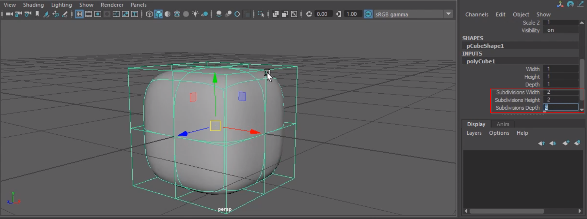
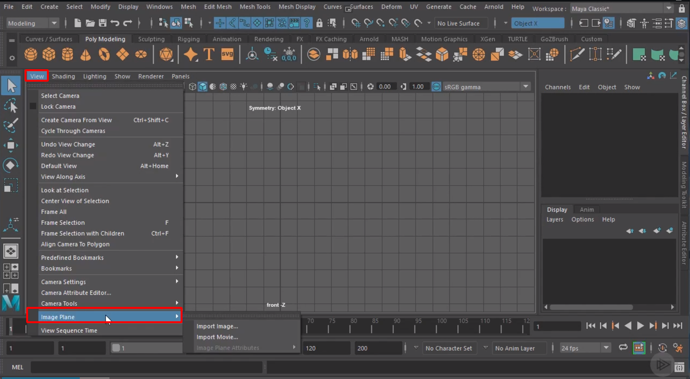

# Maya 2019 Fundamentals: Overview and Modeling
## Justin Marshall

# 1. Getting Started with Maya
- The first step is to get familiar with the basic interface:

- The taskbar options will change based on what kind of task you're working on:

- This is the default view and there are some pre-defined templates to modify the workspace:

- You can configure and Select tools from the Shelf in the UI:

- The Animation Toolbar is on the bottom:

- You can change the viewport for the model on the sidebar:

- You can rotate the model using `ALT+LMB`.
- You can control the zoom level using `ALT+RMB`.
- You can move side to side using the `ALT+MMB` or middle mouse button.
- If you're having issues finding or viewing objects, then you can use the **Outliner tool**:

- If you click on the object and click `f` then it will center on that object.
- If you hit the `a` button then it will *frame up* on everything.
- You can also hit the `spacebar` to change the viewport.
- If you want to switch to a particular viewport then hover with the mouse in the view and press `spacebar` again.
- If you hold the `spacebar` then you can view the **Hotbox** which has lots of other options and views.

- Maya's solution to organizing files is called a **Project**.
- You can create a new Project under **Project Window** option under File.
- To select something, make sure that the **Select Tool** is active.
- You can also press the `q` key on your keyboard.
- Then, you'll want to click on that object.
- You can select multiple parts using `SHIFT+LMB`.
- You can delect by holding down `CTRL` then `LMB`.
- You can also click down `LMB` and then drag the marquee to select multiple objects.
- There is a heirarchy relationship that can be setup but that will be discussed later.
- There are three **Transforms**:
  1. Movement (`w`).
  2. Rotation (`e`).
  3. Scaling  (`r`).
- Here is what the move tool looks like:

- Here is what the rotate tool looks like:

- Scale starts at 1 instead of 0.
- Now to create Geometries:

- The **Outliner** shows a list of everything in the scene.
- To group objects together, select them in the Outliner window and hit the `p` key.
- Don't forget that there is a display layer listing all the things in the scene as well.

- The third box on the object controls how it should display:
  * Blank means normal.
  * T means template.
  * R means reference; looks the same but no selection.
- To add something to that layer, you'd select an object and right click:

- You can create a new group from objects using `CTRL+G` in outliner once objects are selected.
- If you select one object but want the group, then click the `ARROW UP` and you will move up the heirarchy.
- The most basic geometry is called a **Polygon**.
- In order to see the components of a *polygon*, we need to go to **Component Mode**.
- You can `RMB` to get it:

- ... or in the toolbar:

- Or, hit `F8`.
- The first basic component is a **Vertex** which is a coordinate in 3D space.
- You will hear about **Polygon Faces** in three sections:
  1. Triangles.
  2. Quads.
  3. N-gon
- Typically, quads are used when using malformed polygons more often.
- If you select an object and hit `3` then you'll get a presentation of a smoothed version of the object.
- If you hit `2` then you can see the cage for the object.
- You can increae the amount of subdivisions to improve the smoothing:

- You can return to the base cube by pressing `1`.
- The next kind is a different category called a **Non-Uniform Rational B-Spline** or **NURB**.

# 2. Modeling Basics
- We're going to use image planes to help assist us in building.

- The images used as a reference are images.
- You should change the width and hieght of the imported image to assist with details in building it.
- You will want to move the images so they're on the oppisite side of hte scene facing away from the cameron.

- You can use a sheet polygon to make sure the dimensions on the object line up on all axis:

- You can use wireframe on the viewport's toolbar to see both the geometry and the reference image.
- You cannot re-shape a geometry if you don't have any subdivisions.
- Try to minimize to the smallest amount of geometry you need.
- Since you can mirror a side, you really only need to build a single side and get it correct.
- Keep in mind that you can overshoot a little since it will shrink when you smooth it.
- Now to mirror it, you use the Mirror option:

- Beware the **Merge Threshold** which will collapse points if it is too large.
- Now we'll want to consider the object thickness.
- To do this, we're going to use the multicut option.
- While holding down `CTRL`, you can add a new edge loop:

- Beware when bridging geometry that you don't make sharp edges you didn't intend.
- Once done, **Bridge** the geometry.

- You can fill in any holes by adding a surface using the *Fill Hole* tool.
- Now we can apply the smoothing.
- It does this by creating a curved surface between the points you've laid out for it.
- If you want sharper edges then put the points closer together.

- You can enable a mirroring of the actions you perform for consistency:

- You can use the `g` key to activate extrude.

- You can hide anything not selected with `CTRL + 1`.
- Pay attention to the selected tool since it will tell you if you've selected extra geometry.
- If you delete an edge then it will leave the others behind so make sure the use `CTRL + DEL` to get all of them.
- You can use `SHIFT + DRAG` to select and `CTRL + DRAG` to delect.
- When you want to join to geometries together, you'll want to use the Combine after selecting both:

# Adding Detail

# FInishing the Framework

# Completing the Model

# Research:

# Reference:
