# Unit Testing with Python
## Emily Bache

# Unit Testing with Python - Basic Example Using unittest
- A **Unit Test** is defined as a small test for a single element of code.
- Where **element of code** means a method or function.
- These are automated and report a simple pass/fail to each test.
- With the strictest definition, it must not use the filesystem, a database or the network.
- Those other tests might still be useful though.
- You will import from the package `unittest`.
```python
import unittest

class PhonebookTest( unittest.TestCase):
  def test_create_phonebook(self):
    phonebook = Phonebook()
```
- A **Test Case** is a test that can be run independently of other tests and is a *unit test*.
- You will **Assert** a return value against what you expect to check for mode errors.
- For *Python3*, it is already builtin and can be called using `python3 -m unittest`.
- While the examples are including the production and tests in the same place, you'd normally want to place them separate.
- The default way to interpret these is the first argument is what you expect and the second is what you're testing:
```python
def test_lookup_entry_by_name(self):
  phonebook = Phonebook()
  phonebook.add('Bob', '12345')
  self.assertEqual('12345', phonebook.lookup('Bob'))
```
- A **Test Runner** is a program that executes the test and displays the results.
- Let's see another example:
```python
def test_missing_entry_raises_KeyError(self):
  phonebook = Phonebook()
  with self.assertRaises(KeyError):
    phonebook.lookup('missing')
```
- You can request that it print the actual names of each test with `python3 -m unittest -v`.
- You can run only a single test using `python3 -m unittest -q test_phonebook.PhonebookTest.test_lookup_entry_by_name`.
- A **Test Suite** is just a bunch of *Test Cases* that can been ran together.
- You use a decorator to tell the testing run to skip that test:
```python
@unittest.skip('WIP') # the passed string is a comment.
```
- You can refactor code so that it uses a *Test Setup* function.
- It's simply `def setUp(self)` and then whatever code you need inside it.
```python
def setUp(self):
  self.phonebook = Phonebook()
```
- A **Test Fixture** is there to allow tests to only concern themselves with the actual test.
- This is better since no matter what, `tearDown()` always gets run - even if something goes  wrong.
- However, if there is an error in `setUP()` then `tearDown()` will not be run.
- There is also a `def tearDown(self)` that runs after each case too.
- A *Test Case* will have a name as well as three parts:
  1. Arrange: set up the object and collaborators.
  2. Act: Exercise the functionality on the object.
  3. Assert: Make claims about the object & its collaborators.
- There can, and maybe should be, a fourth step called **Clean up**.
- It is better to have separate test cases instead of mixing many into a single Case.
- The assert statement `assertIn()` will check through an interable for the item.


# Why and When Should You Write Unit Tests
- There are a few reason why to labor through the *Testing Suite* building:
1. Understand what you want to build.
2.  They document the code you've written.
  * Should be thought of as *Executable Specification*
  * It shows you the intended use of the functions.
3. They help you design the units.
  * It will make sure you've decomposed the problem into units that are independently testable.
  * Which should mean they are loosely coupled.
  * Example of more testable code:
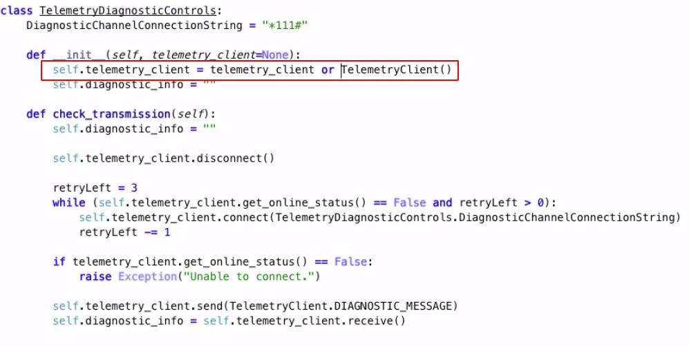
4. They protect against regression in the project.
  * A **Regression** is when something used to work but no longer does.
  * The idea being that a unit test should tell you which test failed and why.
  * And, it will also show you which parts are connected together:

- Unit Testing cannot test correctness.
- They're not very good an testing non-functional requirements and security.
- There are three places for tests:
  1. Test First.
  2. Test Last.
  3. Test Driven.
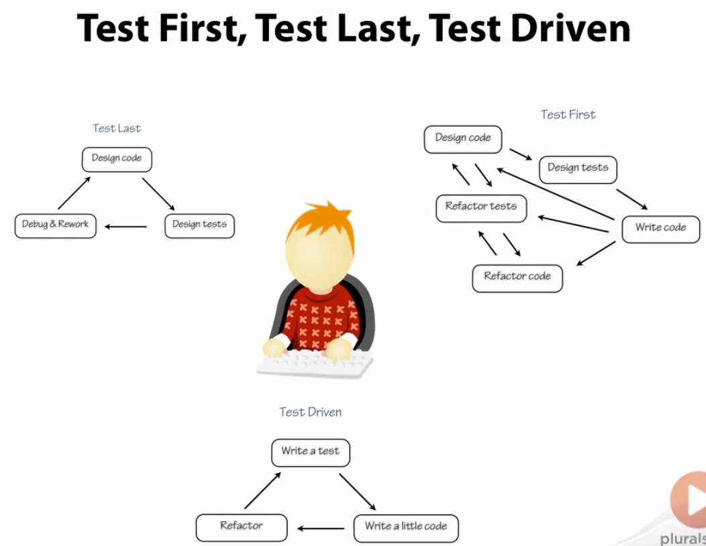
- Starting Tests Last.
  * An *Advantage* is that you don't invest in tests until the design is stable.
  * This avoids having to rewrite both the test cases and the code.
  * This is also somewhat of a risk since the design might not be testable.
  * Might miss cases when you run out of time to implement them.
- Test First.
  * This is where you can control the end image of the code since they'll need to confirm to your tests.
  * There is a risk in reworking code again as you move down the design.
  * This can cause you to refactor code constantly and never reach the end.
- Test Driven Development
  * This is an incremental process where you work back and forth between the test cases and the code.
  * This is what Emily uses most of the time.
- To understand what you need to build, you will certainly need to collaborate.
- When writing the code, may companies use a **Continuous Integration Server**.
- It will watch for changes to the code, pull them, run the tests and alert if there are errors.
- This will only matter if the team takes is seriously.
- It might also check for code coverage.


# Using Pytest for Unit Testing in Python
- We'll be switching over to using **PyTest** now.
- **xUnit** is based on **JUnit** which is authored by Kent Beck and Erich Gamma.
- The test cases we wrote before are arguably not very pythonic.
- Some alternatives to unittest is *python-nose* and *pytest*.
- *PyTest* is not included by default and you will need to install it yourself.
- This can be done using `pip install -U pytest`.
```python
def test_add_and_lookup_entry():
  phonebook = Phonebook()
  phonebook.add( "Dude", '123')
  assert '123' == phonebook.lookup('Dude')
```
- Functions and files *must* be prefixed with `test_` for *pytest* to find it.
- When you run tests - using `python -m pytest` - it will show you relevant information around the failure.
- You will see details such as the line that failed, the objects on both sides and the code around it.
- You can add the error for pytest to include with `assert <assertion code>, 'Text to be used for printing'`.
- In general, you shouldn't use this feature since pytest will give me more information.
- To check for exceptions, you will need to import *pytest*.
```python
import pytest

def test_missing_entry_raises_KeyError():
  phonebook = Phonebook()
  with pytest.raises(KeyError):
    phonebook.lookup('missing')
```
- You can also tell *pytest* to skip a test using `pytest.skip('text to display')`.
- If you use the decorator `@pytest.skip('text')` then the whole file is skipped with all the tests ignored.
- Instead of setup and teardown functions, *pytest* uses decorator test fixtures instead.
```python
@pytest.fixture
def resource():
  return Resources()
```
- The name of the function becomes the name of the resource and will be used by functions further down.
- Make sure to pass those resources to the the functions in your test cases.
- *Pytest* actually comes with quite a few fixtures built in by default.
- If you need to clean up changes before moving on to the next test, then you'll include a **Finalizer** inside the fixture.
```python
@pytest.fixture
def phonebook(request):
  phonebook = Phonebook()
  def cleanup_phonebook():
    phonebook.clear()
  request.add_finalizer(cleanup)
  return phonebook
```
- Don't forget to adjust the fixture call to accept a `request` object.
- Check the latest version since there should be a better way to clean up.
- *Pytest* can create a temporary directory that gets cleaned up after running.
- The directory is actually one of the fixtures and is called `tmpdir`.
```python
@pytest.fixture
def phonebook(tmpdir):
  phonebook = Phonebook(tmpdir)
  return phonebook
```
- You can see all the fixtures being added by appending `--fixtures` to you call to python.
- You really should keep the test in memory and not put them on the file system though.
- *Pytest* will still run *unittest* tests if it finds them in the directory.
- They don't deal well with each other's fixtures though so be wary.


# Testable Documentation with Doctest
- The point of doctest is to make documentation comments more truthful.
- It's included by default in Python and is widely used.
- Usually for three purposes:
  1. Checking Docstring Examples.
  2. Regression Testing.
  3. Tutorial Documentation.
- It's good practice to include **Docstrings** to document how to use your functions.
[Example Docstring](images/example-docstring.png)
- Those, however, end up out of date much of the time - which is where *doctest* comes in.
- The tests are included in the docstring and will be pulled from there.\
[Example of a Decent Docstring With Code](images/filled-docstring.png)
- You run it using `python -m doctest <file>`; output is only displayed on errors.
- If you want to see all the tests and the outputs then pass `-v`.
- If you want *pytest* to find *doctest* then you need to pass `--doctest-modules` to *pytest*.
```
python -m pytest --doctest-modules
```
- You can also do this for unittest but it requires some extra code:
```python
import unittest
import doctest
# your other imports

def load_tests(loader, tests, ignore):
  tests.addTests( doctest.DocTestSuite(<package>))
```
- When running the tests, pytest will stop with the first error while Doctest will use `>>>` to imply it is a case to run and run them all.
- *Doctest* is a stickler about exact results and variable outputs will sometimes throw false positives.
- You will see this with items like dictionaries, floating point numbers or object ids.
- You can intentionally sort the results so it's not dependent on the machine.
- *Doctest* is careful to strip out the line information when testing for Type Errors.
- It also uses `...` to stand for text you don't care about.
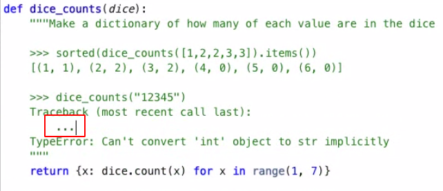
- You can tell *doctest* to ignore output using `#doctest: +ELLIPSIS`.
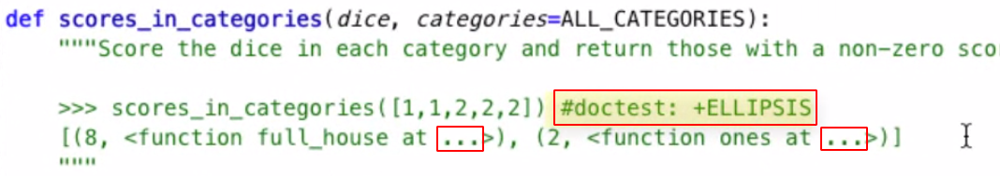
- Using wildcards can be dangerous; it can match much more than you meant it to.
- Sometimes we care more about the regression part than the doctest part.
- And, you can put your examples in a textfile to share and run on other systems.
- You can request that *doctest* run a text file full of the tests using `python -m doctest <filename>`.
- Make sure to import the python dependencies at the top of the file will the prerequisite `>>>`.
- **Approval Testing Cycle**:
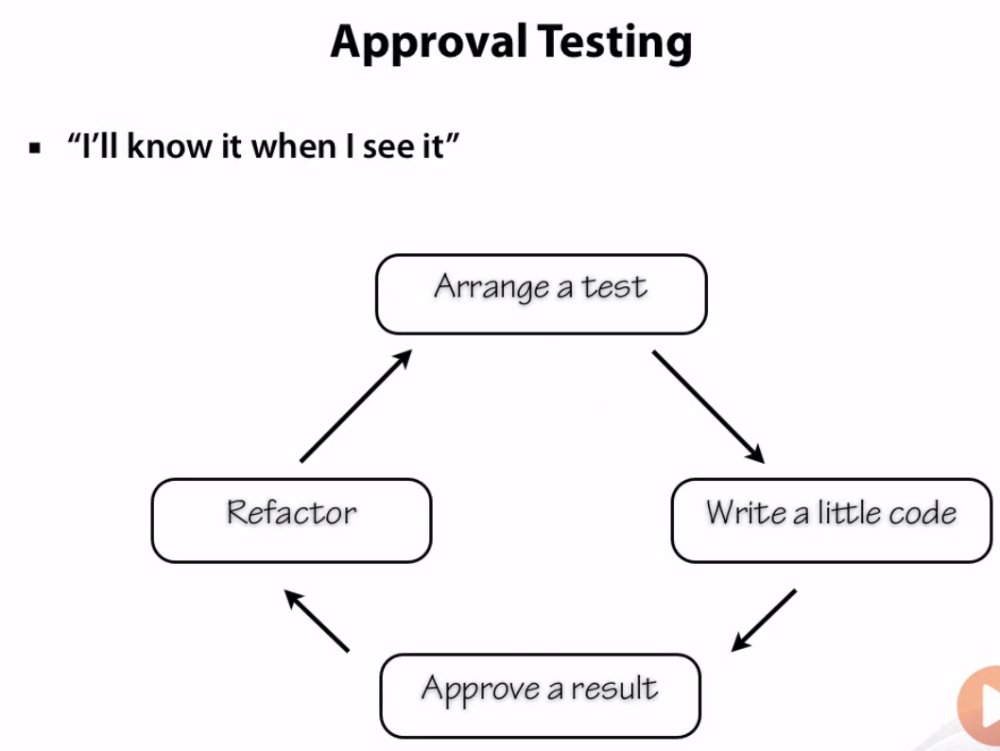
- If you include all those doctests in the actual files then it will be included in your functions and therefore slow them down.
- If they're for examples, put them in the program.
- If they're in for regression testing, put them in a separate file.


# Test Doubles: Mocks, Fakes and Stubs
- **Test Double** is when a class under test doesn't know it's not talking to a real object.
- This allows you to control what happens to the class while being tested.
- There are many kinds of *Test Doubles*:

- A **Stub** is something that stands in for a class of function that is difficult to use in a test case.
- The example would be to pass a configured sensor object:
```python
def __init__(self, sensor=None):
  # ...
  self._sensor = sensor or Sensor()
  # ...
```
- Then you include it in the test:
```python
def test_check_too_low_presure_sounds_alarm(self):
  alarm = Alarm( sensor = TestSensor() )
  self.assertFalse( alarm.is_alarm_on)
```
- *unittest* comes with something called **Mock** for building stubs.
- You import it with `from unittest.mock import Mock`.
- You instantiate and object usiing `Mock( <object> )`.
- You can then assign values using ` obj.value_to_test.return_value = <n>`.
- A *Mock* and a *Stub* are technically not the same thing, but it's not uncommon for people to mistake this.
- An advantage of using a *Mock* is that it will make sure the interface is the same as the object you're really using.
- The **Fake Object** is like a *stub* but it has usable functions and methods.
- Remember, it is better to not write files and tests should remain memory bound as much as possible.
- There is a function in the io package for python that will act as if it's a file in memory called StringIO.
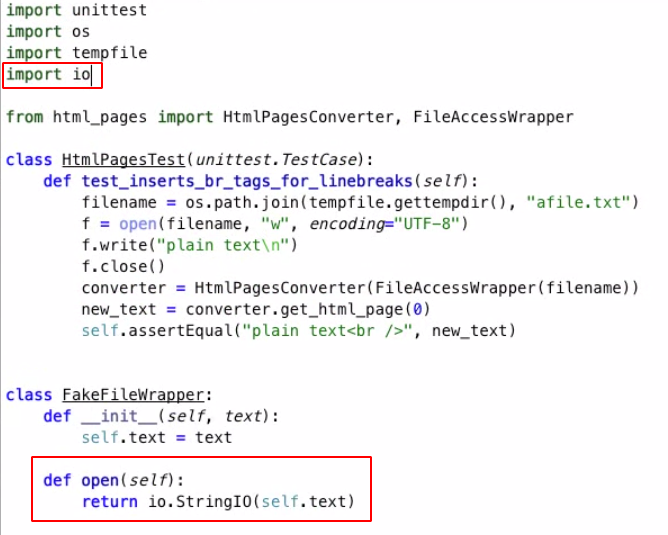
- It is common to use *Fakes* for files, databases and web server responses.
- **Mocks** makes assertions about what actually happened in the test case.
- A *Mock* can cause a test to fail; a *Stub* wont.
- There are three kinds of *assertions*:
  1. Check return value.  (common)
  2. Check the state.     (common)
  3. Check a method call. (uncommon)
- "With a *Mock* you can check a particular method call was made with to a particular object with particular arguments."
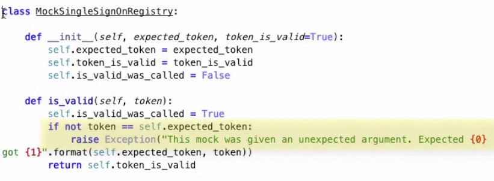
- A **Spy** is something that gets passed along and collects what happens.
- The difference between a Spy and a Mock is that the Mock throws at Action step while Spy throws at Assert step.
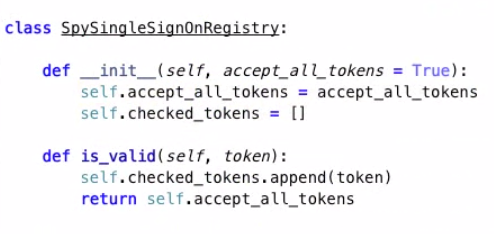
- It can be a decorator that runs along with it.
- **Dummy Objects** is used when you have a required argument that is not necessary for the test.
- This doesn't happen very often and if it does then you have a required arguement that shouldn't be required.
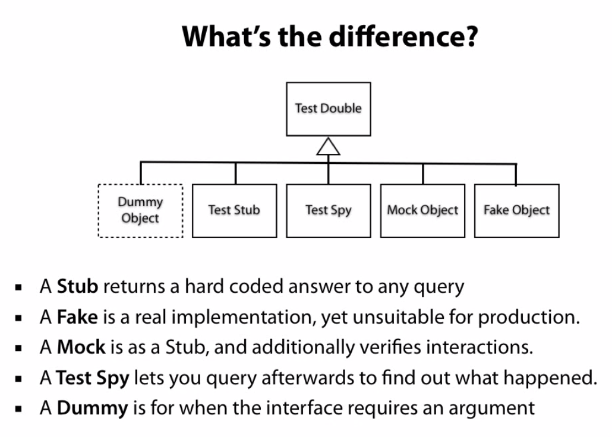
- **Monkeypatching** is when you dynamically change code at runtime.
- Also called **Metaprogramming**.
- You have to tell patch which module you'll want to path and not which class it's actually in.
- An example would be `with patch('alarm.Sensor') as test_sensor_class` even though it's defined in `sensor.py`.
- You will need to build a Mock to compare against:
```python
with patch('alarm.Sensor') as test_sensor_class:
  test_sensor_instance = Mock()
  test_sensor_instance.sample_pressure.return_value = 22
  test_sensor_class.return_value = test_sensor_instance
  alarm = Alarm()
  alarm.check()
  self.assertTrue( alarm.is_alarm_on )
```
- You can also use a declaration syntax by adding `@path('alarm.Sensor')` above the call and cut out the with statement.
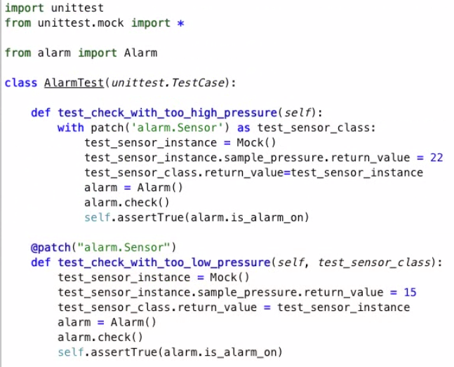
- You should think of *Monkey Patching* as a last resort since it implies code smell.


# Test Coverage and Parameterized Tests
- **Parameterized Test Cases** is when you define combinations of what you expect, and then generalize function such that it tests all expect combinations.
- You will need an object, array, or dictionary to store the data along with a function that can return a function.
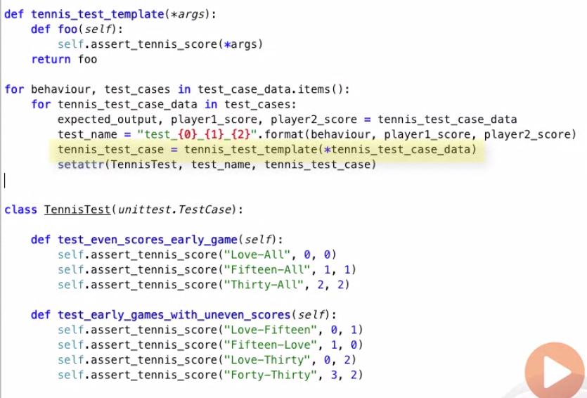
- Doing something like this in *pytest* is actually easier since it has a decorator for it: `@pytest.mark.parametrize()`:
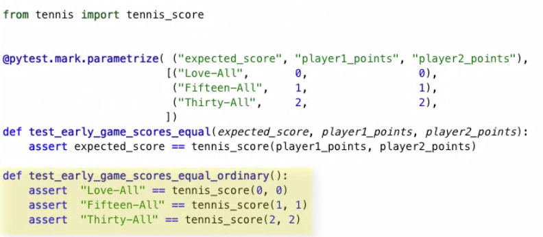
- Adding comments to your parameters will make the test failures easier to reason about.
- We're going to now go over how to manage coverage documentation.
- You're going to need to install them with `python -m pip install coverage pytest-cov`.
- To ask it to check for coverage, you'll need to tell it what module.
- To have *Pytest* manage this you'll need to run `python3 -m pytest --cov-report term-missing --cov tennis`.
- If you want an HTML report instead, then you'd pass `html` instead of `term-missing`.
- If you want a function to be skipped, then just add the comment `# pragma: no cover` on the function definition.
- You can also generate a report using unittest using `python3 -m converage run -m unittest`.
- This will only generate the data but it not display.
- Then, you build the report using `python3 -m coverage report`.
- If you want an html version, then you pass `html` instead of `report`.
- **Coverage Branch** is when a Coverage Test tells you if all outcomes at a logical branch have been traversed.
- This will add the metric *partial* to your coverage.
- To do this for PyTest, you'll need a `.coveragerc` file:
```
# in the file
[run]
branch = True
```


# Research:
- Continuous Integration Server?
- X Unit Patterns book?
- html_pages package?
- io package?

# Reference:
- [Unit Test Documentation](https://docs.python.org/3/library/unittest.html)
- [Martin Fowler Continuous Integration](www.martinfowler.com/articles/continuousIntegration.html)
