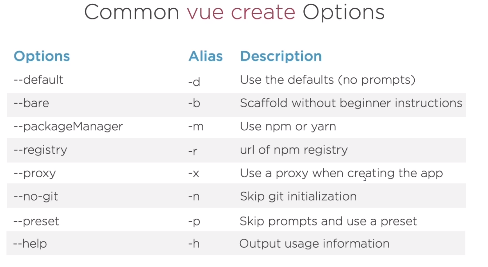
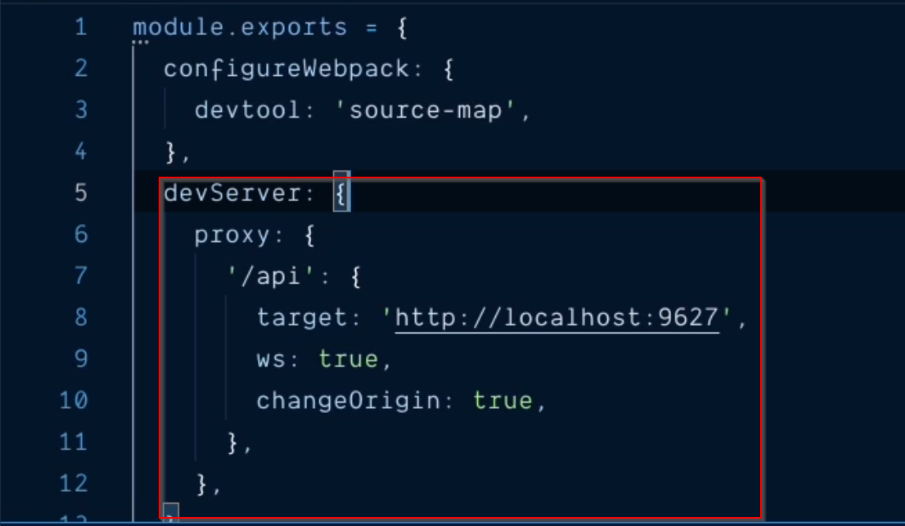
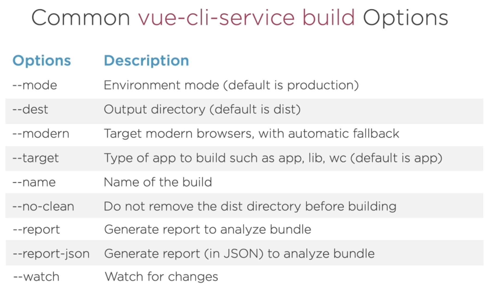

# Developing Faster With the Vue CLI
## John Papa

# Getting Started with the Vue CLI
- First we need to get it installed and we do that with:
```
npm i -g @vue/cli @vue/cli-service-global
```
- Once the App.vue is created, you can just run `vue server -o` and it will start it.
- Now that you have this online, you can play with it to configure it.
- It also will check for when the file updates and will autoreload it.
- This allows us to have a rapid development experience.
- It can also do some optimizations.
- To create a new project you'd run `vue create <project-name> -d`.
- The `-d` flag means to use the defaults.
- Vue also has a `serve` script to start a project using `npm run serve`.
- You can use the `--help` to get help info at any command depth.
- By default, it will add three scripts: `lint`, `build`, `server`.
- You're not limited to the console but can start a Vue CLI UI.


# Setting UP the Vue CLI
- Now we're going to talk about the prerequisites for Vue CLI.
- The first one is Node.js .
- One that's installed, you'll of course install vue like above.
- You can also use yarn: `yarn global add @vue/cli`.
- It's a good idea to verify the version with `--version`.
- You can start the UI version with the command `vue ui`.


# Mastering Essential Vue Tools
- Now we'll explore a range of topics around the browser, console, etc.
- You can instantiate a vue project without the beginner scaffolding using `-b` of `create`.
- There is a plugin for the browser called **vue-devtools** that will present a better interface for Vue Projects in your browser.
- You can set break points in the Development Tools in the UI.


# Creating a Vue Application
- Lots of thoughts go through a developer's mind about what the project should look like when it's started.
- Now we're going to review what Vue comes with to assist with this.
- Here are some of the aliases that we can use:

- You can combine some of the vue options.
- **Babel** is useful for older browsers.
- **history mode for router** is for more modern routing.
- You can create **Presets** which is a saved configuration of prompts that you can use when creating new projects.
- They are saverd in a .vuerc file.
- You can also save them in a *preset.json*.
- If the preset somewhere else then you can point to that instead:
```
# git repo:
vue create hello --reset <acct-name>/<repo-name>

# local file:
vue create hello --preset ~/<path>
```


# Building and Serving Vue
- In this module, we're going to look at how to build and serve Vue applications.
- By the end of this module, you should be able to tell the difference between apps, libraries and web components.
- The heart and soul is the **Vue CLI service**.
- It uses webpack for builds and serving along with biuld and invoking some bpm scripts to make the process consistent and easy.
- Inside the vue.config.js file, it sets up a proxy route that tells it to use a different port when connecting to `/api`.

- Some useful arguments for `npx vue-cli-service` is:
  * `--open`: open in a web browser.
  * `--copy`: copy url to clipboard.
  * `--host`: specify the host IP
  * `--port`: specify the host port.
- Normally, this process happens in memory but if we want it on the drive, then we'll use `build`.
- This will change some defaults such as the mode to production.

- If you're going to be build lots of Web Components, etc then you should setup npm scripts for them.
- When building a libray, you'll want to include a `index.js` where all the imports and export is for everything in your library.
- It's also where you should expect people to check when they're trying to analyze the library.
- You will need to include a `main` component with the path to the entry point into the library.
```js
"main": "./dist/<project-name>.common.js",
"files": [
  "dist/*",
  "src/*",
  "public/*",
  "*.json",
  "*.js"
],

```
- With a web component, it will allow you to import the code as a script tag to add to your site.


# Running Unit and End to End Tests


# Adding Packages and Plugins to Your Vue App with the Vue CLI

# Creating Vue Apps with Vue CLI's UI


# Refernce:
- [Vue Documentattion](https://vuejs.org)
- [heroes-vue project](https://github.com/johnpapa/heroes-vue)


# Research:
- Mocha Tester?
- Chai Tester?
- Jest Tester?
