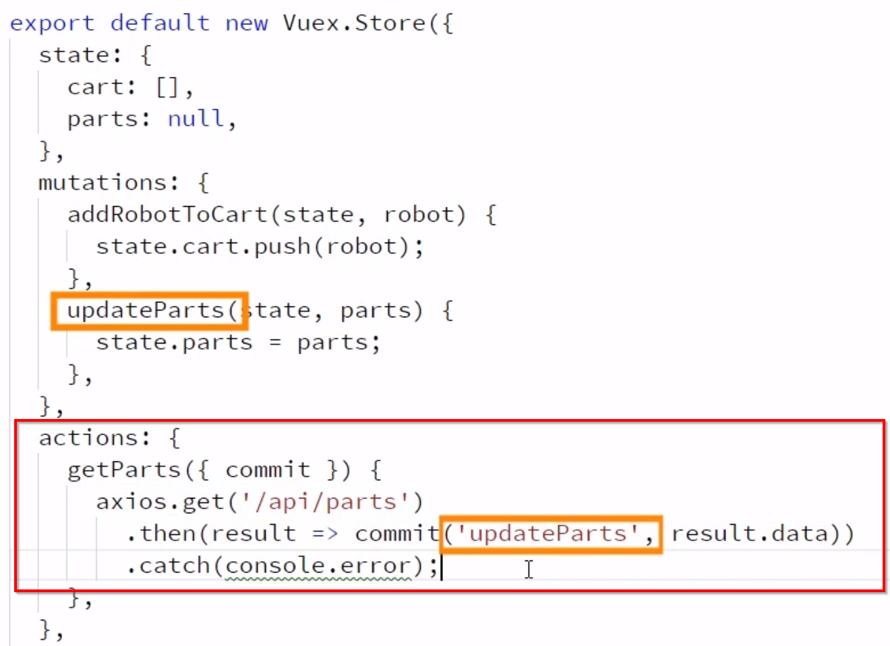
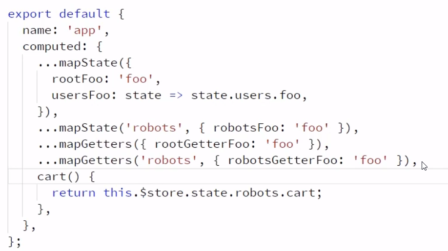

# Vue.js Fundamentals
## Jim Cooper

# Getting Started with the Vue.js CLI
- We're going to build a Build-a-Bot Website.
- A **Vue Instance** is called whenever you call `new Vue()`.
- In a typical Vue application, you'll only have one Vue Instance.
- If you're familiar with React or Angular, then you'll be familiar with the Components and sub-components of Vue.
- You'll also have **Router Views** which will change based on what the contents are.
- So, we'e going to work on creating this from the ground up.
- We're going to need some tools:
  * git
  * node.js
- We create a project with `vue create build-a-bot` with the CLU interface.
- Much of this has come as of version *3.x* of the Vue CLI.
- Another person that recommends Visual Studio Code.
- You can run the created project using `npm run serve`.
- Right now, there is only the render function in the file:
```js
import Vue from 'vue';
import App from './App.vue';

new Vue({
  render: h => h(App),
}).$mount('#app');

```
- When you look at the App.vue file, it's clear a browser cannot read this.
- There is a component of Vue that will read and compile it into a format they can use.
- One of the rules is that Components should be at least two words.


# Creating Vue.js Components and Using Template Syntax
- **Components** are really just Vue Instances.
- When you look at one, it has this format:
```
const World = Vue.component(
  'World',
  { template: '<span>World</span>'},
  );
```
- Inevitably, global variables cause problems because they are hard to locate.
- It's also easy to run into naming conflicts.
- All of the global components must be a Javascript String.
- While they may encapsulate the variables, the CSS is left out.
- Globals have no build time complitation support.
- A Single-file Component is a file with a .vue extension.
- There are typically three sections:
  1. A template section.
  2. A Script Section.
  3. A Style section.
- You *must* have a template and script section but can leave out the style section.
- Make sure to include an export call inside the script section of the component.
```
<script>
  export default {
    name: 'RobotBuilder',
  };
</script>
```
- We're skipping over most of the CSS since it's not vue specific.
- In order to provide data to our component, we need to update our components to have a data option.
- This will be included in the Script subsection:
```
data() {
  return {};
}

```
- Webpacks has some magic at the top of the parts.js file that allows it to simply konw where those images are:
```
const images = require.context('./images', true, /\.png$/);
```
- You will use `v-bind:src="<data.heads[0].src>"` in the components now.
- Now to let users change the parts, we'll need to discuss `v-on`.
```
<button v-on:click="selectNextHead()" ... >Turtles</button>
```
- There are shortened syntaxes for:
  * `v-bind:` as `:`
  * `v-on:` as `@`
- We display raw data on the page with interpolation.
- Vue has two directives to conditionally show elements on a page: `v-if` and `v-show`
- `v-show` leaves the elements in the DOM while `v-if` actually removes them.
- When building things likes carts, make sure to initialize defaults otherwise Vue wont detect the changes.

- Never use `v-if` and `v-for` on the same line.
- Vue adds `v-data-<hash>` on elements to handle scope.
- You add the attribute `scoped` to the `<scripts>` tag in the vue.
- What Vue means when it says that styles are scoped is that it's not going to apply the style directly outside the scope.
- Font color is inherited; borders are not.
- Now, if you want to do this deep selection, you'd want to use the **Deep Selector**.
```
.content >>> .robot-name {
  color: red;
  border: 2px solid blue
}
```
- This will affect the child components of your child components.
- Valid JS does not allow hyphens so to add CSS with them you'd do this:
```
<div class="top part" style="{[background-color]: '3px solid red'}">
```
- It's better to use classes then inline styles.
- Vue.js fully supports CSS Preprocessors.
- You can install them via `npm install node-sass sass-loader --save-dev`
- Then you just add it to the styles section as `<style lang="scss">`
- **Compents Lifecycle Hooks** are actions we can take based on the life cycle states of a component.
- You can do this by using a function called `created(){}` and issuing code inside it for the component.

# Enabling inter-component Communication
- Now we're going to build different components in their own .vue files.
- First you'll import it and then you'll declare it:
```
import availableParts from '../data/parts';
const parts = availableParts.heads;
```
- When you import components, you'll also need to list them in the parent component.
```
components: [PartSelector],
```
- Then, you can tell the component what to look for with:
```
<partSelector :parts="availableParts.heads" />
```
- You can add types to ensure that what is passed is what is expected.
- In addition, you can specify a validator.
```js
position: {
    type: String,
    required: true,
    validator(value) {
      return ['left', 'right', 'top', 'bottom', 'center'].includes(value)
    },
  },
}
```
- We now need a way to tell our parent component that the robot parts have changed.
- We do this by running an emit call: `this.$emit('partSelected', this.selectedPart)`.
- Now in the parent component you'd bind to it with `v-on:="part => selectedRobot.head=part"`
- But if you refresh the page and add the robot to the cart, then it wont work since no events have been emitted.
- So, now we'll use the `created()` which will be called when the component is created.
- Time to create a collapsible component.


# Routing from Page to Page
- Adding routing to an existing project is really quite easy.
- We just need to install the Vue Routing Package.
- You'll install it with `npm install vue-router --save`
- We'll create a new router folder.
- Then, we'll import vue-router: `import Router from 'vue-router';`
- Then, you tell vue to use it.
- Then, you build the routes:
```js
import Vue from 'vue';
import Router from 'vue-router';

import HomePage from '../home/HomePage.vue'
import RobotBuilder from '../home/RobotBuilder.vue'

Vue.use(Router);

export default new Router({
  routes: [{
    path: '/',
    name: 'Home',
    component: HomePage
  }, {
    path: '/build',
    name: 'Build',
    component: RobotBuilder,
  }],
});

```
- Now we need to tell the app to use this new route based on the Vue.
- We'll replace `<RobotBuilder/>` in App.vue with `<router-view/>`
- There will be a #/ in the url and we'll address removing it later.
- Now we'll discuss how to setup links to those other pages.
- To setup a route, we'll use Vue's router link element.
```
<router-link to "/build"></router-link>
```
- You can also use a binding to the different router.
```
<router-link :to="{name: 'Home'}"></router-link>
```
- The class `.router-link-active` is a special class used by Vue.
- This is applied to any links that match the current route.
- You can ensure that it's an exact match by adding `exact` to the `router-link` tag.
- You can also setup routes that accept passed on parameters.
- You do this with:
```
methods: {
  showPartInfo(){
    this.$router.push0('/parts');
  }
}
```
- When you've update the route, it will look like this with variables: `path: '/parts/:partType/:id'`.
- The route parts are on the components route:
```
const partType = this.$route.params.partType;
return parts[partType].find(part => part.id === id)
```
- There is a problem with the above code since those will always be strings and we need the id to be an integer.
- Also, we cannot pass those as strings in the `$router.push` and will need to use the object notation.
```
this.$router.push({
  name: 'Parts',
  params: {
    id: this.selectedPart.id,
    partType: this.selectedPart.type
  },
});
```
- You can enable props with routes by simply adding `props: true` in the route.
- Then you'll add `props : ['partType', 'id']` to the index.js file.
- So, there is a way to change the URL but only update content on the current page using **Nested Routes**.
- You'll need to create the route and then add `children`
- Then, you can use the name of the child route with `<router-link :to`.
- Now let's discuss **Named Routes** which are multiple routes on a single component.
- You'll specify this using `<router-view name="sidebar"/>`.
- The reason that the url has the # in them is because **HTML5 History Mode** is not enabled.
- To enable this, you just need to add `mode: 'history'` inside the Router.
- There is a complication in that if someone bookmarks that page then you Web Server doesn't actually have a path for that.
- So, you'll need to require your webserver to load the main page when anyone hits it.
- We'll discuss this more when we cover pushing code into production.
- **Navigation Guards** prevent a page from loading or prevent a user from leaving a page conditional on criteria.
- You can add these on a component or a route.
- Adding it to a route would look like this:
```
beforeEnter(to, from, next){
  const isValidId = Number.isInteger(Number(to.params.id));
  next(isValidId);
}
```
- Now we'll want to prevent or warn a user to leave a page to prevent losing progress.
- We are going to do this inside the component - but inside a route would work too.
```
beforeRouteLeave( to, from, next){
  if this.addedToCart){
    next( true );
  } else {
    const response = confirm('Progress will be lost!');
    next( response );
  }
}
```


# Managing State and Server Communication with Vuex
- At the heart of Vuex is the **Vuex Store** which provides an interface for storing and mutating data.
- It's a shared data store to work with Vues data change detection.
- At the core is the State Tree which contains all the data for your application.
- By telling the store to commit a **Mutation**, it keeps everything in the store consistent.
- For Async calls, you'd use **Actions** instead.
- It can also contain logic along with the data for common calls using **Getters**,
- You'll install it with `npm install vuex --save`
```
import Vue from 'vue';
import Vuex from 'vuex';

Vue.use( Vuex )

#  ===[ Added to main.js ]===
import store from './store';

new Vue({
  render: h => h(App),
  router,
  store,
}).$mount('#app')
```
- Our store will need a state object which is where we will put all of our data.
- All changes must be done via a Mutator.
```js
export default new Vuex.Store({
  state: {
    cart: [],
  },
  mutations: {
    addRobotToCart(state, robot){
      state.cart.push(robot);
    },
  }
})
```
- Then with the store you use `this.$store.commit('addRobotToCart', Object.assign({}, robot, {cost}))`
- Sometimes you'll want to access computer properties inside the Store.
- To add these, you'll add a `getters` subsection in the store:
```
getters: {
  cartSaleItems(state) {
      return state.cart.filter( item => item.head.onSale )
  }
}
```
- You'll access it in the same way but you'll look at `$store.getters` instead.
- While these synchronous calls are useful, most Web Servers now are using Asynchronous calls.
- So, we're going to add `actions` to the Store now.
```
actions: {
  getParts( {context} )
}
```
- The `context` exposes several items for working with the state.
- Examples include:
  * state
  * getters
  * commit
  * dispatch
- Vue doesn't provide any of its own Data access methods so we're going to use **axios**.
- We're going to install it with `npm install axios --save`.
- The structure looks like `axois.get('<url>:<port>/<api-path>')`.
- However, using a localhost to get this working will not work in production so we'll need to create a proxy.
- That information will be contained in the file in the root of our project called `vue.config.js`.
```
module.exports = {
  devServer: {
    proxy: {
      '/api' : {
        target: '<address>',
        changeOrigin: true,
      },
    },
  },
};
```

- You use `dispatch()` to kick off actions:
```js
this.$store.dispatch('getParts');
```
- Now we're going to see how to save data to an API.
- We start with a new action in the store.
- `axios.post` returns a promise.
- Now we'll look at how to build modules for the *Store* to break it up.
- Create a Modules folder and put the index.js with the store in that directory.
- Now after importing, you will change the store call to `this.$store.state.robots.cart;`.
- In the future, Actions and Mutations should end up being the same but they're not now.
- You might be wondering how Vue knows which module's Action call to use.
- In actuality, it didn't know.
- Vue however can be told to keep them separated if we tell it too.
- So, we'll tag `namespace: true` in the .vues and they'll be separate now.
- So, when calling the function with `.dispatch` you'll need to use the namespace: `'robots/addRobotToCart'`.
- How you define getters is different with namespaces: `this.$store.getters['robots/cartSaleItems']`.
- Any state that you add to non-namespaced modules is global.
- There is a lot of boilerplate in the code right now and now lets resolve that.
- Vuex providers a Mapped State Helper to assist with this.
- You'll import it with `import { mapState } from 'vuex';`.
- Then, you'll use it with `...mapStore({ rootFoo: 'foo'})`.
- This syntax only works with namespace modules:
```js
...mapState('users', { usersFoo: 'foo' }),
```

- Now we'll discuss **Map Actions** which are a little different.
```js
...mapActions('robots', ['getParts', 'addRobotToCart']),
#....

this.getParts() // don't need to call dispatch anymore.
```
- `mapMutations` is basically the same thing.


# Creating Custom Directives and Filters
- Not we're going to discuss how to create our own Directives.
- As an example, we're going to build a directive that when it is added will move it to the bottom left.
- Create a file called pin-directive.js
```js
export default {
  bind: (element) => {
    element.style.position = 'absolute';
    element.style.bottom = '5px';
    element.style.right = '5px';
  },
};
```
- These come with `args` and `modifiers`.
- To iterate over them:
```js
export default {
  bind: (element, binding) => {
    if ( binding.arg !== 'position') return;

    Object.keys(binding.modifiers).forEach((key) => {
      element.style[key] = '5px';
    });
    element.style.position = 'absolute';
  },
};

```
- Declare with: `v-pin:position.bottom.left`
- The other way to pass values to custom directives is: `v-pin:"{ bottom: '10px', right: '5px'}"`.
- However, this wont hotload until you refresh since the directive is not noticing the changes.
- There is another Lifecycle hook that we'll bind to.
```js
update: (element, binding) => {
  applyStyle(element, binding );
},
```
- There are a few others:
  * `inserted` when the element has been intserted into its parent node.
  * `componentUpdated` where it fires only after all children elements have fired.
  * `unbind` is called when the element us unbound from its parent component.
- Since the `bind` and `update` are so common, there is a shortcut to use them both together.
- You just leave all of it off and use `export default function (element, binding){ <function-to-do-stuff>}`.
- This is scoped only to where we imported it but you can set it globally.
- In the main.js file, you would include  `Vue.directive( 'pin', pinDirective );`
- Now we'll discuss how to create custom filters.
- A Filter is really just a function.
- Create a file and the function must always accept at least one variable.
```js

export default function (amount){
  return `$${amount.toFixed(2)}`;
}
```
- Then you add the filter the default object after importing it.
```js
filters: {
  currency: currencyFilter,
},
```
- You can also declare it globally using `Vue.filter('currency', currencyFilter);`


# Deploying Vue Applications to Production
- The basic Vue Build is a Zero config with reasonable defaults that can be modified whenever necessary.
- What is included out of the box?:

- Plan is to cover a basic Vue.js build with CLI.
  * Using environment vars and build modes.
  * Deploying to a production Web Server.
  * Handling Deep Linking.
  * Inspecting the built-in webpack config.
  * Customizing the webpack config.
- To tell it to build for production, use `npm run build`.
- Those files will end up in the `dist` folder.
- You can actually just copy it to a place where a webserver can serve it.
- Anything we include in the folder `public` while building will end up in the final dist folder.
- Sometimes you want different environments for different places.
- We can do this with the mode flag.
- By default when you run `build`, it is in production mode.
- Setting this flag controls the `node_env` variable.
- You can name and build different modes by creating a file called `.env.<env-name>`.
- It will use any environmental variables we include in the file.
- You can pass environmental variables to the app by putting them in that file and then calling `created() { process.env.VUE_APP_TEST};`
- Vue will only display environmental variables that are prepended with `VUE_APP_`.
- You can serve this by adding a line `app.use('/', express.static('dist', {index: 'index.html'}))`
- Now we'll come back to deep linking in HTML5 History Mode.
- Basically, you'll want to always forward to the index.html page on any unknown url requested.
- Then, you'll ask the app to manage the route.
- This is different for different web servers but this is common enough that Express has a builtin middleware.
- You get it with `npm install connect-history-api-fallback`
- We can check the configurations in modes using `vue inspect --mode=<mode>`.
- Now only can you see it but you can add to it.
- You add them to your vue.config.js file under `configureWebPack: {}`.


# Reference:

# Research:
