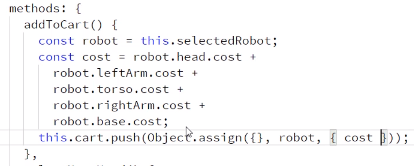

# Vue.js Fundamentals
## Jim Cooper

# Getting Started with the Vue.js CLI
- We're going to build a Build-a-Bot Website.
- A **Vue Instance** is called whenever you call `new Vue()`.
- In a typical Vue application, you'll only have one Vue Instance.
- If you're familiar with React or Angular, then you'll be familiar with the Components and sub-components of Vue.
- You'll also have **Router Views** which will change based on what the contents are.
- So, we'e going to work on creating this from the ground up.
- We're going to need some tools:
  * git
  * node.js
- We create a project with `vue create build-a-bot` with the CLU interface.
- Much of this has come as of version *3.x* of the Vue CLI.
- Another person that recommends Visual Studio Code.
- You can run the created project using `npm run serve`.
- Right now, there is only the render function in the file:
```js
import Vue from 'vue';
import App from './App.vue';

new Vue({
  render: h => h(App),
}).$mount('#app');

```
- When you look at the App.vue file, it's clear a browser cannot read this.
- There is a component of Vue that will read and compile it into a format they can use.
- One of the rules is that Components should be at least two words.


# Creating Vue.js Components and Using Template Syntax
- **Components** are really just Vue Instances.
- When you look at one, it has this format:
```
const World = Vue.component(
  'World',
  { template: '<span>World</span>'},
  );
```
- Inevitably, global variables cause problems because they are hard to locate.
- It's also easy to run into naming conflicts.
- All of the global components must be a Javascript String.
- While they may encapsulate the variables, the CSS is left out.
- Globals have no build time complitation support.
- A Single-file Component is a file with a .vue extension.
- There are typically three sections:
  1. A template section.
  2. A Script Section.
  3. A Style section.
- You *must* have a template and script section but can leave out the style section.
- Make sure to include an export call inside the script section of the component.
```
<script>
  export default {
    name: 'RobotBuilder',
  };
</script>
```
- We're skipping over most of the CSS since it's not vue specific.
- In order to provide data to our component, we need to update our components to have a data option.
- This will be included in the Script subsection:
```
data() {
  return {};
}

```
- Webpacks has some magic at the top of the parts.js file that allows it to simply konw where those images are:
```
const images = require.context('./images', true, /\.png$/);
```
- You will use `v-bind:src="<data.heads[0].src>"` in the components now.
- Now to let users change the parts, we'll need to discuss `v-on`.
```
<button v-on:click="selectNextHead()" ... >Turtles</button>
```
- There are shortened syntaxes for:
  * `v-bind:` as `:`
  * `v-on:` as `@`
- We display raw data on the page with interpolation.
- Vue has two directives to conditionally show elements on a page: `v-if` and `v-show`
- `v-show` leaves the elements in the DOM while `v-if` actually removes them.
- When building things likes carts, make sure to initialize defaults otherwise Vue wont detect the changes.

- Never use `v-if` and `v-for` on the same line.
- Vue adds `v-data-<hash>` on elements to handle scope.
- You add the attribute `scoped` to the `<scripts>` tag in the vue.
- What Vue means when it says that styles are scoped is that it's not going to apply the style directly outside the scope.
- Font color is inherited; borders are not.
- Now, if you want to do this deep selection, you'd want to use the **Deep Selector**.
```
.content >>> .robot-name {
  color: red;
  border: 2px solid blue
}
```
- This will affect the child components of your child components.
- Valid JS does not allow hyphens so to add CSS with them you'd do this:
```
<div class="top part" style="{[background-color]: '3px solid red'}">
```
- It's better to use classes then inline styles.
- Vue.js fully supports CSS Preprocessors.
- You can install them via `npm install node-sass sass-loader --save-dev`
- Then you just add it to the styles section as `<style lang="scss">`
- **Compents Lifecycle Hooks** are actions we can take based on the life cycle states of a component.
- You can do this by using a function called `created(){}` and issuing code inside it for the component.

# Enabling inter-component Communication
- Now we're going to build different components in their own .vue files.
- First you'll import it and then you'll declare it:
```
import availableParts from '../data/parts';
const parts = availableParts.heads;
```
- When you import components, you'll also need to list them in the parent component.
```
components: [PartSelector],
```
- Then, you can tell the component what to look for with:
```
<partSelector :parts="availableParts.heads" />
```
- You can add types to ensure that what is passed is what is expected.
- In addition, you can specify a validator.
```js
position: {
    type: String,
    required: true,
    validator(value) {
      return ['left', 'right', 'top', 'bottom', 'center'].includes(value)
    },
  },
}
```
- We now need a way to tell our parent component that the robot parts have changed.
- We do this by running an emit call: `this.$emit('partSelected', this.selectedPart)`.
- Now in the parent component you'd bind to it with `v-on:="part => selectedRobot.head=part"`
- But if you refresh the page and add the robot to the cart, then it wont work since no events have been emitted.
- So, now we'll use the `created()` which will be called when the component is created.
- Time to create a collapsible component.


# Routing from Page to Page
- Adding routing to an existing project is really quite easy.
- We just need to install the Vue Routing Package.
- You'll install it with `npm install vue-router --save`
- We'll create a new router folder.
- 


# Managing State and Server Communication with Vuex

# Creating Custom Directives and Filters

# Deploying Vue Applications to Production

# Reference:

# Research:
