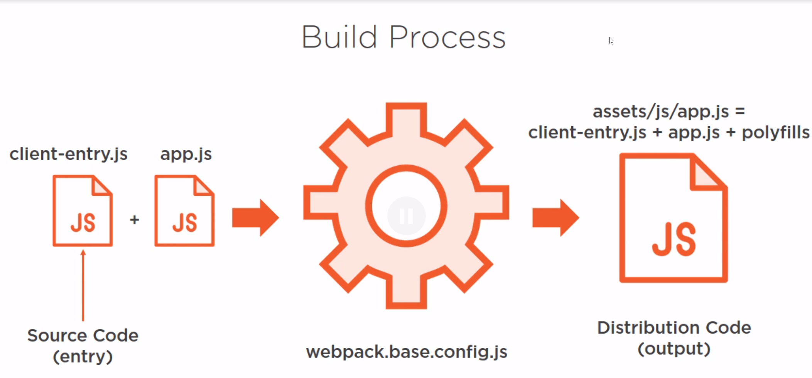
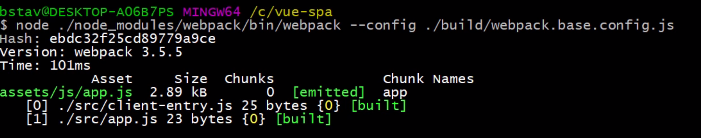
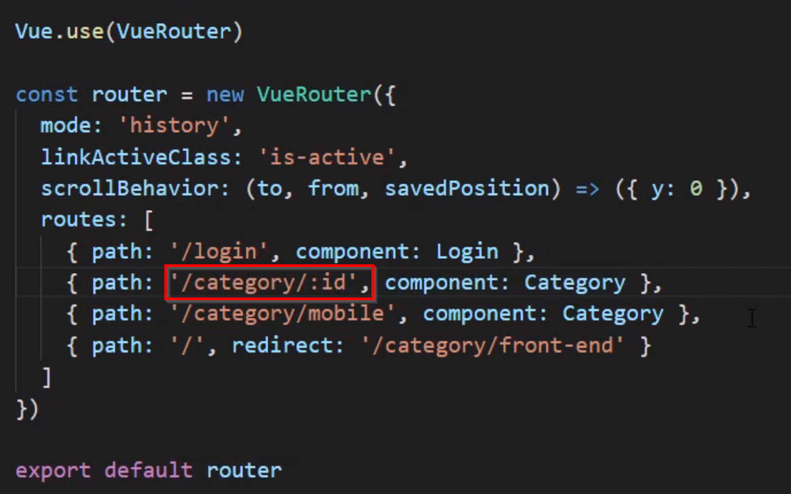
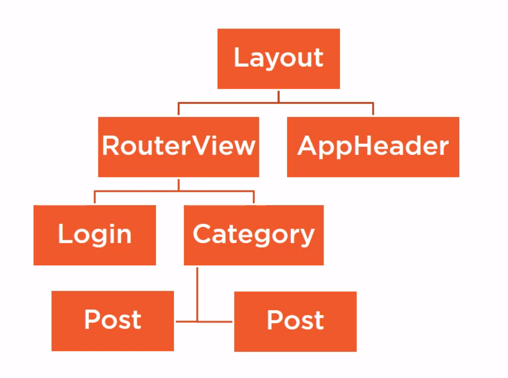
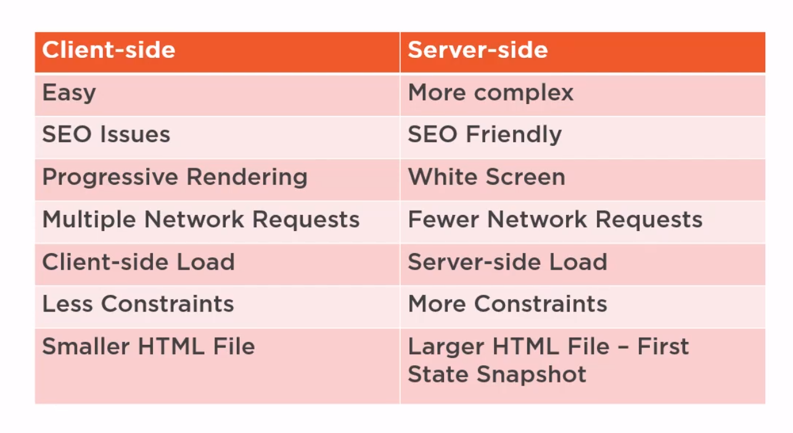
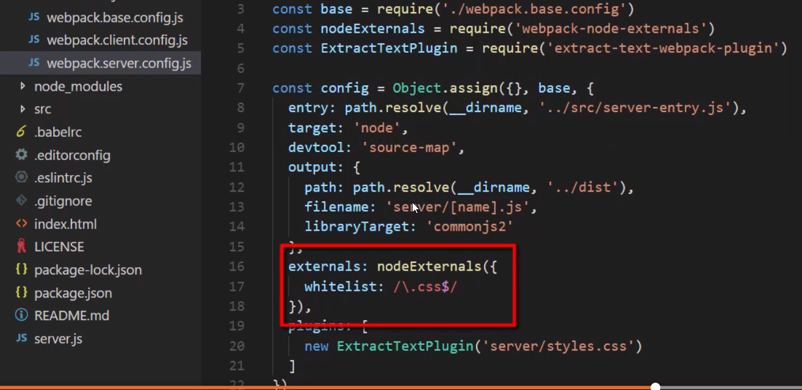

# Single Page Applications with Vue.js
## Bill Stavroulakis

# Environment Setup - Build Process
- Vue.js can be a small component to manipulate the DOM.
- As well as modern single page web pages.
- This is not a fundamentals course.
- A project should include:
  1. A License File.
  2. A README.MD file.
  3. An index.html file.
- There are three favored ways to handle package management:
  1. bower
  2. jspm
  3. npm
- Once installed, you can run `npm init -y` to start working and configure settings.
- This will create a *package.json* file which is where all the dependencies will be contained.
- Two keys to pay attention to are `dependencies` and `devDependencies` which control what is needed in dev and prod respectively.
- There are a few ways to get Vue.js into our project.
  1. With a CDN include.
  2. [Recommended] Install with npm.
- The argument `--save` creates a `node_modules/vue/dist` with all the files.
- It will also add it as a dependency in the *package.json* file.
- There are also many choices of web servers but we're going to use *express.js*.
- You will install it with `npm install express --save`
- Then, create a file called *server.js*.
```js
const express = require('express');
const app = express();

app.get('*', (req, res) =>{
  res.write('Maor Turtles');
  res.end();
});

const port = process.env.PORT || 3000;
app.listen( port, () => {
  console.log('turtles!')
})
```
- We'll want to serve the file system node module to serve the page itself.
```js
const fs = requires('fs');
const path = requires('path');

const indexHTML = (() => {
  return fs.readFileSync( path.resolve( __dirname, "./index.html"), "utf-8");
})();

//..
res.write(indexHTML)

```
- No, instead of remembering the paths of our scripts, we'll create a shortcut.
- We'll add `"start": "node server"` to the *package.json* file.
- The thing with modules is that they are not supported on all browsers.
- The two most common polypher is *browersify* and *webpack*.
- We'll be using *webpack*.
- We'll need to create a folder called *build* with a file in it called `webpack.base.config.js`
- Then, we'll install it with `npm install webpack --save-dev`.
- Now we'll need to include all the modules needed for webpack.
- Webpack modules start with entry points.

```js
const path = require('path');

const config = {
  entry: {
    app: path.resolve(__dirname, "../src/client-entry.js")
  },
  output: {
    path: path.resolve(__dirname, "../dist"),
    publicPath: "/",
    filename: "assets/js/[name].js"
  }
};

module.exports = config;
```

- Now we'll add vue to the app.js file.
```js
import Vue from "vue";

const app = new Vue({
  data: {
    hello: 'hey turtles'
  }
});

export { app };
```
- Once it's loaded, you can then mount it in the *client-entry.js* file.
- Don't forget to mount it and add the appropriate attribute.
- Starting and stopping the server is annoying so we're going to install two modules to assist:
  * `npm install webpack-dev-middleware --save-dev`
  * `npm install webpack-hot-middleware --save-dev`
- This will allow them to be stored in memory and updated when changes are detected.
- **Linting** enforces coding standards on events - usually saving.


# Single File Components
- You can declare a Vue Component with `Vue.component('app', template: <html goes here>)`
- The `render` function returns an element of the app/component.
- While you can do this, it is recommended that you have separate .vue files for each component.
- This will contain the *template*, *script* and *style* sections.
- Then, you import it in the app.js file.
- By default, webpack doesn't know what loader to use for .vue files.
- The community has written one that can be included in the *webpack.base.config.js*.
- You will also have to install it `npm install vue-loader vue-template-compiler --save-dev`.
- The **Spread Syntax** is `...`.
- Now with `...AppLayout` will spread the properties of the declared Vue instance.
- However, not all browsers can support this so we'll be installing **Babel** which converts it to compatible older JS format.
- You will need to install them:
```
npm install babel-core babel-eslint babel-loader babel-preset-es babel-preset-stage --save-dev
```
- There are a lot of library choices for the Style Library but we're going to be using bulma.
- You install it `npm install bulma --save`.
- Now we'll include CSS in the style tag of the Layout.vue file.
- We're going to use hard coded JSON objects in the data field of our .vue file.
```js
.columns {
  flex-wrap: wra
}
```
- We can create child components when the .vue file gets too large to manage.
- You will just need to import them in the script section of the .Vue file that is serving as our main.
- Remember to do that with: `import AppHeader` from `./AppHeader.vue`
- And, to include them as components in the script section.
- The **Props** attribute binds the data in our script subsection to the tags in our template subsection.
- A **Slot** element allows you to reserve sections for content.
-
```html
<!-- inside Post.vue -->
<slot name="title"></slot>

<!-- inside Post.vue -->
<h3 slot='title'>{{ post.title }}</h3>
```
- We'll modify the cards so that they're the correct dimensions:
```css
.card{
  padding-bottom: 40px;
  height: 100%;
}
```
- This change will then apply to the footer.
- We can stop this by adding `scoped` to the style subsection.
- The CSS is being included in the head of the file instead of separate like best practices.
- We're going to install an extract plugin for Webpack:
```
npm install extract-text-webpack-plugin --save-dev
```


# Routing
- Vue has a plugin for this called *vue-routing*.
- We install it with `npm install vue-router --save`
- Then you will add a new file *router.js*
```js
import Vue from 'vue'
import VueRouter from 'vue-router'

Vue.use(VueRouter)

const router = new VueRouter({
  routes: [{
    path: '/', component: Category
  }]
})

export default router
```
- When loading a new page, we'd like to only load the components and not the full page.
- You can tell it where to place the view itself when clicked by adding:
```js
scrollBehavior: (to, from, savedPosition) => ({y: 0})
```
- ... to the VueRouter.
- Vue,js exposes the router via `this.$route.params.<param>`.
- You can associate routes with components as well as include parameters with the route:

- `watch:` can be used on a route to update params internally when a user changes routes.
- You can can access to GET request variables in the URL using: `this.$route.query.page`.
- You can also add names to a route `name: 'category'`.
- You can add a wildcard route to collect any paths that don't match: `path: '*', component: NotFound``
- "If it is working, then you don't have enough features".
- To only load a route when it is visited, we can use **Lazy Loading**:
```js
const Category = () => System.import('...')
const Login = () => System.import('...')
const NotFound = () => System.import('...')
```


# API Communication
- We're going to be using the library **Axois** for API Requests.
- We will install it using `npm install axios --save`.
- It is normal to have a service file: *app.service.js*.
```js
import axios from 'axios';

axios.defaults.baseURL = '<url-here>'

const appService = {
  getPosts( categoryID){
    axios.get('/some/path/${categoryID}/results')  //this is a promise
    .then(response => {
      resolve(response.data)
    })
  }
}

export default appService
```
- Vue sanitizes HTML before returning it but you can override this with the directive `v-html=`
- You can ask a function to run when a use clicks something using the `v-on:click="f()"`.
```js
login(){
  appService.login({ username: this.username, password: this.password})
  .then((data) => {
    window.localStorage.setItem('token', data.token)
    window.localStorage.setItem('tokenExpiration', data.expiration)
  })
  .catch(() => window.alert('Could not login!'))
}
```
```js
axios.interceptors.request.use( function (config){
  const token = window.localStorage.getItem('token')
  if( token ){
    config.headers. Authorization = 'Bearer ${token}'
  }

  return config
})
```


# State Management
- The content we have built is already getting large enough to be a problem:

- What do you do when you don't want to share content only from parent to child?
- We're going to create a file called *event-bus.js* that will trigger and handle events.
- Every time the `isAuthenticted` changes, we'll emit and event: `eventBus.$emit('authStatus')`.
- The reason we want to detach the state and logic is to prevent a web of complexity while updateing and communicating across components.
- We have the library **Vuex** to assist with this in Vue.
- You install it with `npm install vuex --save`.
- The Store is just a way to centralize state:
```js
import Vue from 'vue';
import Vuex from 'vuex';

Vue.use(Vuex)

const state = {
  isAuthenticted: false
}

const store = new Vuex.Store( {
  state
})

export default store
```
- The store is kept in the variable `$store`.
- We really don't want to access the state directly.
- ...


# Server-side Rendering
- Many bots wont wait for scripts to finish before parsing the contents of the page.
- Sometimes this is ok; sometimes this is not ok.

- This first step is to create a file *server-entry.js*.
- Don't forget to install `npm install webpack-not-externals`

- The mismatch of the VDOM on the client and server will cause errors.


# Testing

# Deploying

# Reference:
- [Project Github Page](https://github.com/bstavroulakis/vue-spa)
- [EditorConfig](https://editorconfig.org)
- [jwt.io](https://jtw.io)

# Research:
- Vue slot elements?
- Interceptors?
- Redux.js?
- Node.js MFS?
-
