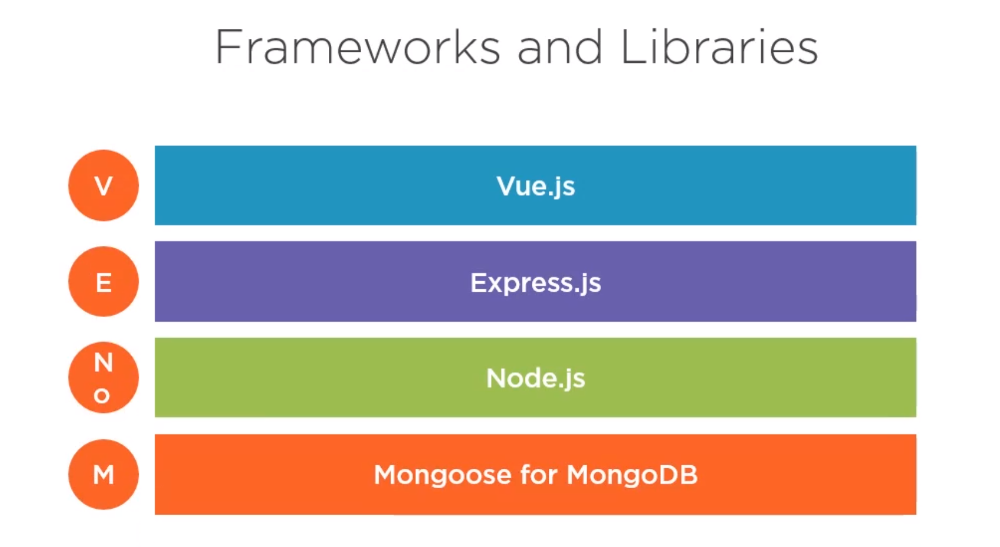
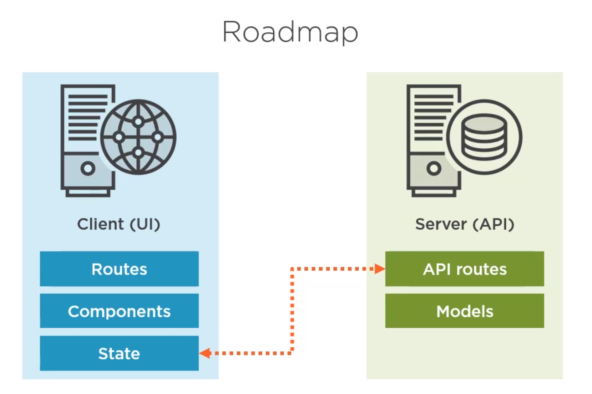
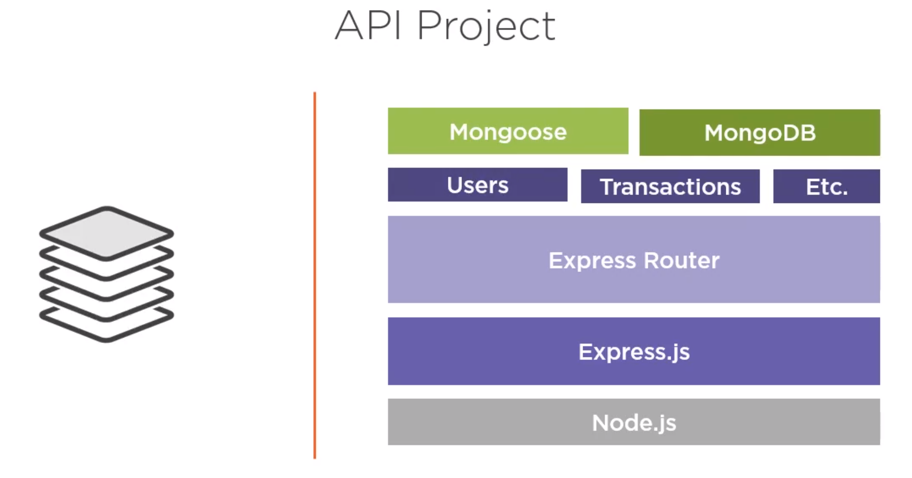
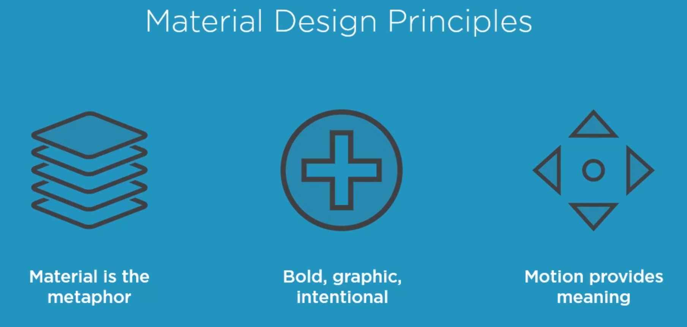
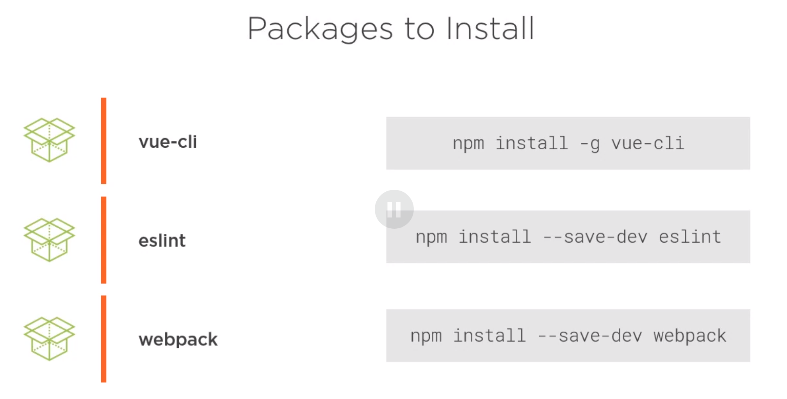
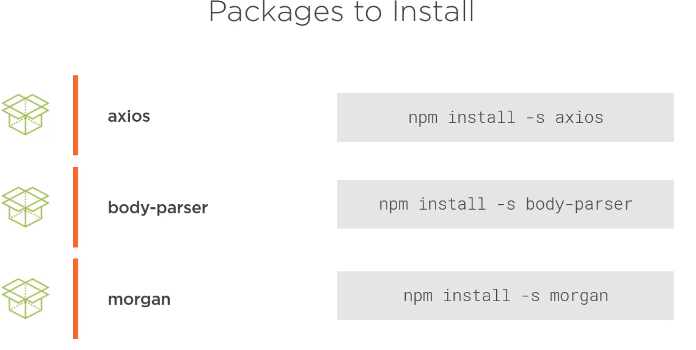
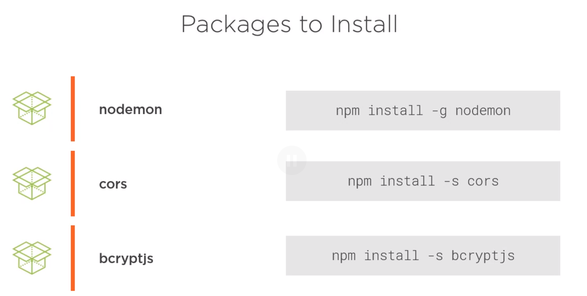

# Building Business Applications with Vue.js and MongoDB
## Mark Scott

# Get Introduction to the Course
- Vue.js is growing in the Application world.
- We're going to go over how to build an application with Vue.js and MongoDB.

# Technology Stack Overview
- If you're looking to be a full stack JS developer and looking for a tech stack then welcome.
- This course will introduce you to the **Venom Stack** for Application Development.

- We're going to be working on a minimally viable application for a client.
- We're building a basic banking interface.

# Setting Up the Demo Applications
- We're start with an Architectural Approach to the project.
- The parts are:
  1. UI Layer.
  2. RESTful API.
  3. Data Access.
- *Separation of Concerns* is important for tech swapping.

- The Core of the framework is Node.js.
- The API layer will be Express.js
- The UI Layer will be managed by Vue.js
- The connection to the Database can be managed by the app or by something design explicitly for that management: **Mongoose**.
- It might be worth watching the other courses about Mongoose to help out.
- Having data is of no use if you cannot access or use it.

- We'll be using **Material Design Principles** from the the Material Design Project.
- Those principles are:
  1. Material is the metaphor.
  2. Bold, Graphic, Intentional.
  3. Motion provides meaning.

- From that project, we'll be using *Vuetify* from this project.
- This supplies us with lots of attractive assets for UI usage.
- We'll be using a few other npm packages as well:

- We'll be using the **Postman** program to test our APIs.
- We could develop our MongoDB database via the Comamnd line but we're going to use a different tool instead called Studio 3T.
- The Free version would be Robo 3T instead.

# Designing the Data Layer with MongoDB and Mongoose

# Developing the API with Node and Express

# UI Development with Vue.js and Vuetify

# Manage Application State with Vuex

# Getting Data from the API

# Finalizing the Demo Application

# Summary:

# Research:
- [Material Design Website?](materials.io)

# Reference:
