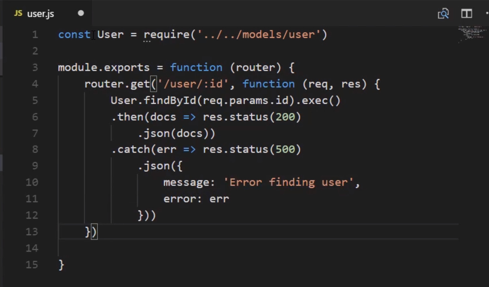
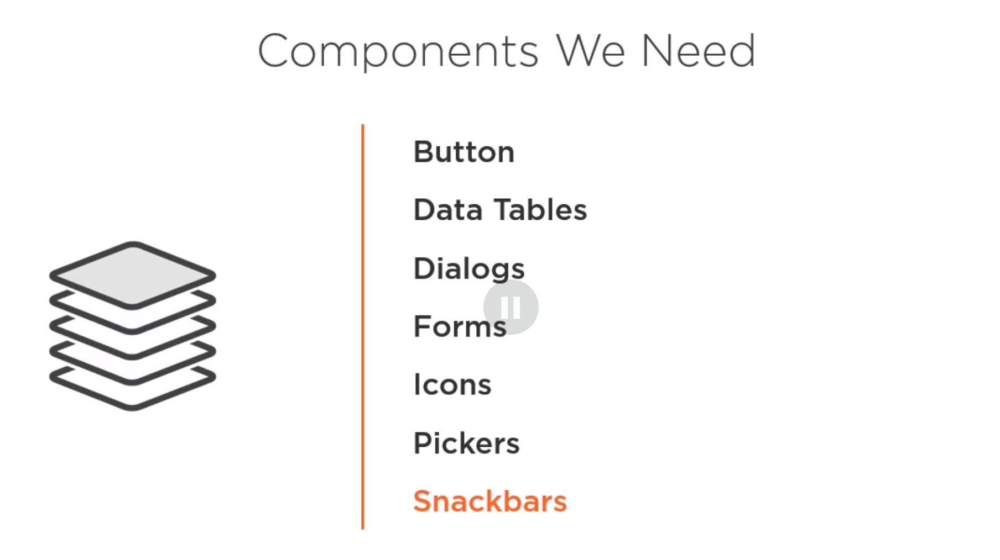

# Building Business Applications with Vue.js and MongoDB
## Mark Scott

# Get Introduction to the Course
- Vue.js is growing in the Application world.
- We're going to go over how to build an application with Vue.js and MongoDB.


# Technology Stack Overview
- If you're looking to be a full stack JS developer and looking for a tech stack then welcome.
- This course will introduce you to the **Venom Stack** for Application Development.

- We're going to be working on a minimally viable application for a client.
- We're building a basic banking interface.
- We're start with an Architectural Approach to the project.
- The parts are:
  1. UI Layer.
  2. RESTful API.
  3. Data Access.
- *Separation of Concerns* is important for tech swapping.

- The Core of the framework is Node.js.
- The API layer will be Express.js
- The UI Layer will be managed by Vue.js
- The connection to the Database can be managed by the app or by something design explicitly for that management: **Mongoose**.
- It might be worth watching the other courses about Mongoose to help out.
- Having data is of no use if you cannot access or use it.

- We'll be using **Material Design Principles** from the the Material Design Project.
- Those principles are:
  1. Material is the metaphor.
  2. Bold, Graphic, Intentional.
  3. Motion provides meaning.

- From that project, we'll be using *Vuetify* from this project.
- This supplies us with lots of attractive assets for UI usage.
- We'll be using a few other npm packages as well:


- We'll be using the **Postman** program to test our APIs.
- We could develop our MongoDB database via the Comamnd line but we're going to use a different tool instead called Studio 3T.
- The Free version would be Robo 3T instead.


# Setting Up the Demo Applications
- Now we'll be builing and installing everything.
- Install nodejs
- We'll also need to install yarn from [yarn's website](yarnpkg.com)
```bash
npm install -g vue-cli
```
- Then we'll create the project in the correct directory:
```bash
vue init webpack client
# vue initialize <template> <project-name>
```
- This will give you a few fields to fill out.
- Then you change to the correct directory; the start with:
```bash
npm run dev
```
- Normally, you will have a different server for the API and the database:

- We're going to use separate folders to simulate this.
- After getting the project folder loaded, we'll start working in main.js


# Designing the Data Layer with MongoDB and Mongoose
- We should ask ourselves whether the data or the design matters more to the users.
- In our case, we'll work on the Data layer first.
- Once you're ready, navigate to [Install MondoDB](docs.mongodb.com/manual/installation/) to install MongoDB for your OS.
- Download and install Robo 3T and create collections **users** and **transactions**.
- **"Everything in Mongoose starts with a schema"**.
- Here is the schema we'll be using:

- Here are the Mongoose Schema Types:

- Calling `npm init -f` will force it to use the default settings and not ask for anything.
- We'll want auto-reload on changes and *nodemon* is a popular choice.
- You can install it using `npm install nodemon -g`.
- Now we'll define our models in the `models` folder in our **server** folder project.
```js
const mongoose = require('mongoose')
const Schema = mongoose.Schema

let userSchema = new Schema({
  first: { type: String, required: true },
  last:  { type: String, required: true },
  email: { type: String, required: true },
  password: { type: String, required: true },
  isActive: { type: Bool, default: true },
  createdOn: { type: Date, default: Date.now }
})

const User = mongoose.model('User', userSchema)
modeule.exports = User
```
- We're doing the same thing for transactions:
```js
const mongoose = require('mongoose')
const Schema = mongoose.Schema

let transactionSchema = new Schema({
  userId: mongoose.SchemaTypes.ObjectId,
  transactionDate:  { type: Date, required: true },
  transactionType:  { type: String, required: true },
  description: { type: String, required: true },
  charge:  { type: Number, default: 0 },
  deposit: { type: Number, default: 0 },
  notes:   { type: String, default: '' },
  createdOn:   { type: Data, default: Date.now },
})

const Transaction = mongoose.model('Transaction', transactionSchema)
modeule.exports = Transaction
```


# Developing the API with Node and Express
- Looking over the connections to each model:


- We'll be setting up routes for each model.
- We'll want to modify the package.json scripts file so that "scripts" contains:
```js
"scripts": {
    "start": "npm run lint & nodemon app.js",
    "lint": "./node_modules/.bin/eslint **/*.js"
}
```
- The file app.js is where the application starts.
```js
const express = require('express')
const app = express()
```
- I am just going to write notes and hopefully upload the code later.
- This is what the current folder structures should look like:

- You can add a package to the project using `yarn add <package>` - if you have yarn installed.
- You can tell it which port to use using `app.set('port', (process.env.PORT || 8081))` in the app.js file.

- Use the mongoose function `.save()` to save values to mongodb:

- Transactions can be passed as a pipeline of queries using the `.aggregate(pipeline)` function in mongoose.

- You can bundle routes in the index.js file:

- You can also start the server using `yarn run start`.


# UI Development with Vue.js and Vuetify
- We're now going to finally start using Vue.js for the core parts of the application.
- Here are the core features of the Application:

- Reminders for what we're planning for the project:

- Components:
  * Home.vue
  * Transactions.vue
  * EditTransactions.vue
  * Login.vue
  * About.vue
- Once you're done modifying files, then you can run `npm run build` or `yarn run build` to compile it.
- When building, you can automatically fix many linting problems using `yarn run lint --fix`.
- Now to work on getting the website to look clean.
- If at all possible, use the Veutify pre-builts to save yourself time.
- We'll want to install it using `yarn add veutify` or `npm install vuetify`
- Don't forget to modify and import in App.vue and to also build again once this is all changed.
- Needed components for our project:


- Add the Vue.js Dev Tools for your browser.


# Manage Application State with Vuex
- A Script block contains a number of options:

- We're going to dig into a package for Global State management called Vuex.
- Vuex Workflow:

- The **State** is the single source of truth across the entire application.
- Simple Example:
```js
const store = new Vuex.Store({
  state:{
    user: null,
    isAuthorized: false,
    roles: []
  }
})
```
- Think of **Actions** as the gateway into your store.
- It is possible for an *action* to call another *action*: **Action Chaining**.
- **Mutations** are where we actually change the state of the application.

- There are times when you may need to create values from saved state.
- This is where **Getters** can come in handy.
- You don't have to use modules in Vuex and can simply keep one big state.
- However, these can get too big to manage and you can split them up:


# Getting Data from the API
- We'll be using **Axios** to communicate with out APIs.


- Remember that you will get a **Cross-Origin Resource Sharing** when services are running on different ports.
- We can fix this by installing and setting up cors.


# Finalizing the Demo Application

# Summary:

# Research:
- [Material Design Website?](materials.io)
- GitLens Extention in VSCode?

# Reference:
