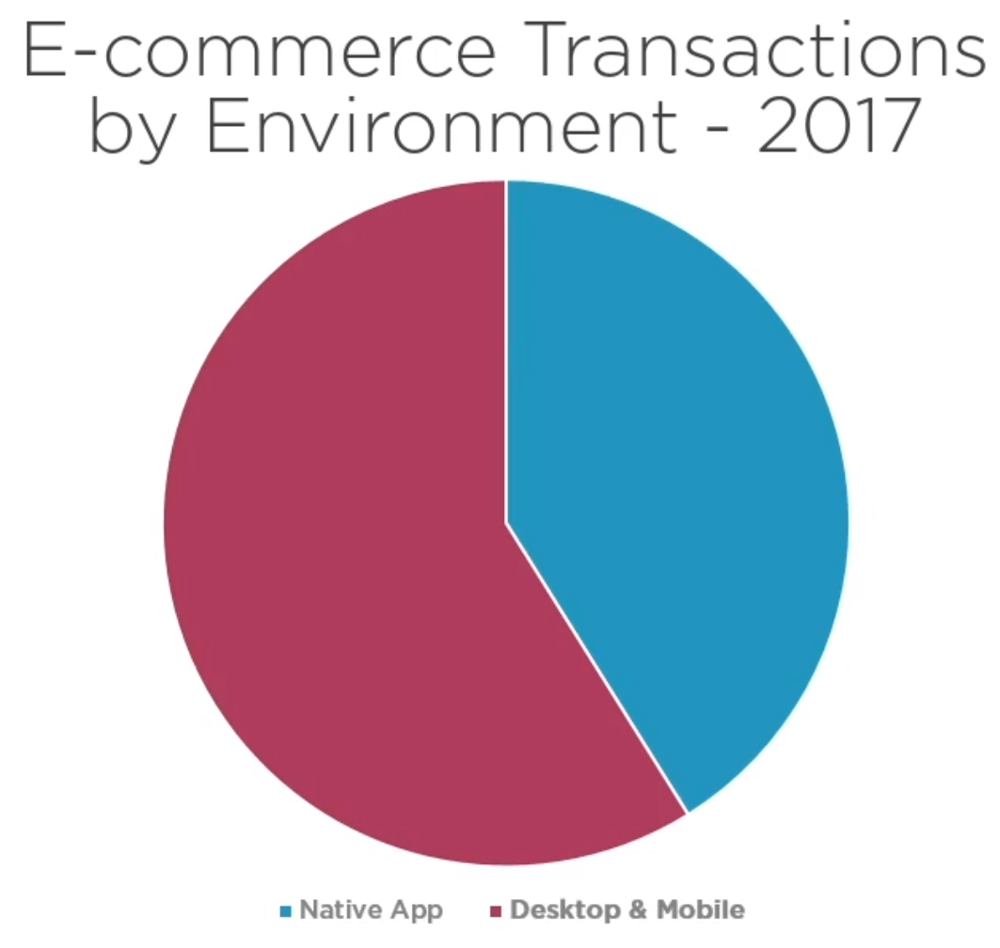

# Vue.js: Big Picture
## Daniel Stern

# What is Vue.js?
- This course is to help you decide if you'd like to further your education.
- We're going to discuss what it is and whether it will help you with your business goals.
- We're going to discuss the core features of Vue.js.
- We're going to go over what specific challenges Vue.js was designed for.
- We're going to understand it better by comparing it to other popular JS frameworks.
- Then, pass along further resources to learn about Vue.js.
- E-commerce is moving in the direction of mobile phones:

- Vue Apps can be built quickly; fast performance and small; build a view layer for app.
- What are the potential costs of using something else?:
  * Mobile users get bored due to slow load times.
  * Redrawing lists or updating the DOM is very slow.
  * Developers employed to update the application are slower and expensive to hire.
- So why Vue?:
  * It works for new or existing applications.
  * Replete with features familiar to those using React/Angular.
  * Feels simpler to understand and maintain.
  * Vue is popular.
- Who should use Vue?:
  * Small teams or individuals prototyping small apps.
  * Large teams collaborating can still find it useful; huge projects might not benifit.
  * Small contractors trying to update a legacy site.
    * You can *spot modify* sections of websites by filling it in with Vue.js

# Why Use Vue.js
- 

# The Vue Ecosystem

# Reference:

# Research:
