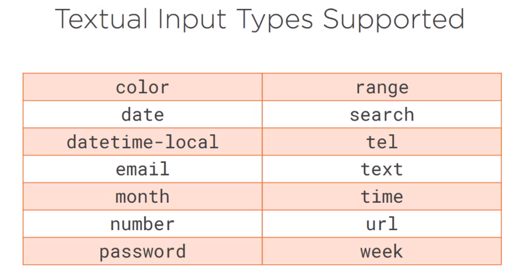

# Vue.js: Getting Started
## Chad Campbell

# Introduction to Vue.js
- Vue.js is an intuitive Framework for building Web Apps.
- It has a focus on speed and simplicity.
- "Complexity can make an app error prone and difficult to maintain."
- **Templates** separate the UI from the Data and Business Logic.
- Exmaple;

- *Templates* minimize how much code you have to write.
- They also protect you from changes.
- **Declarative Bindings** are the glue that holds the UI and data together.
- From a Runtime perspective, changing the DOM is expensive.
- This is because the browser has to recalculate everything in the window.
- The **Virtual DOM** is like a lightweight copy of the actual DOM.
- It efficiently determines what needs to be updated and batches those updates.
- Two other concerns to bring up will be Browser support and licensing.

- The maintainers of Vue.js has stated that the CDN unpkg is the most well synced source for including.
- Always include the url source as `https://unpkg.com/vue` which redirects to the latest version of Vue.js
- If you want to specify the version, then you can use `https://unpkg.com/vue@<version>/dist/vue.min.js`
- Include it at the bottom of the page and ours will looks like:
```
<script
  type="text/javascript"
  src="https://unpkg.com/vue@2.2.5/dist/vue.min.js"
</script>
```
- The library **Axios** is the recommended way to make HTTP requests.
- The script block is the same but just points to `.../axios/.../axois.min.js` instead.
- To initialize an instance of Vue,
- This is how you initialize the app on the Data side:
```vuejs
var growler = new Vue({
  el: '#growler',
  data: { }
});
```
- **Mounting** is when you make the view becomes visible to the user.
- The tag `el` specifies where it will be mounted onto into the webpage.
- You can use a CSS Selecter `'#growler'` or using the longer version `docuemnt.getElementByID('growler')`
- This will replace the element in the page with the View generated.
- Due to this, **do not set it to body or html elements**.
- Each View has a lifecycle.
- They are:
  1. Creation.
  2. Mounting.
  3. Updating.
  4. Destroy.
- Each hook for each stage is named:
  * `before<State>`, `<state>ed`
- The creation state starts when you call the `Vue()` constructor.

- Note that you must call the destroy instance explicitly otherwise it will not run.


# Creating Vue.js Templates
- Templates are created as HTML.
- The data property servers two purposes:
  1. At design time, it represents the schema.
  2. At runtime, servers as the model.
- **Plain Old Javascipt Object (POJO)**
- Vue makes shortcuts to the data properties for you to access.
- When initialized, the `Object.defineProperty` function sets up the getters and setters of the object.
- You can only modify properties that exists once declared.
- You cannot add or remove them either.
- Due to this, objects don't lookin like normal API calls:

- Naming rules are:
  * Letters, digits, dollar signs, underscores.
  * Must start with a letter.
  * Case sensitive
  * Cannot use reserved words.
- One specific rule only for Vue is that properties should not start with $ or _
- The value of the property is what will show in the Vue.
- **Data Properties should just be data!**.
- Vue accepts primitive types but ignores other not native object types.
- Example being: Number, String, Date, Array
- Vue has two ways to bind text to a view:
  * Semantic Syntax with `{{ }}`; also called moustaches.
    * If the value does not exist, then it will replace it with an empty string.
  * Declarative Bindings are created via directives.
    * All baked in directives start with `v-`.
    * Another example would be `v-text="appName"` which will do the same thing.
    * If you need to bind to only part of an element then use semantic syntax.
    * The directive `v-once` will only allow an element to change once and never again.
    * Keep in mind that the children of an element with this directive will inherit it as well.
    * You can pass raw html but you will need to use the `v-html` directive otherwise it shows as raw text.
    * Note that you cannot nest bindings.
    * Only bind to HTML you trust.
    * Don't bind to User Generated HTML.
- The directive `v-bind` is for binding to HTML attributes.
- This allows you to bind data property values to HTML attributes.
- This would look like `v-bind:src="appLogo"` but can also look like `:src="appLogo"`.
- While you should keep your design separate from your logic, sometimes it's unavoidable.
- When you have to, you'll need to choose between getting it from a JS object of a JS array.
```
v-bind:style="{ color:color }"
```
- If you need to change properties with - in them then you can use Camel Case and it will still work.
```
fontFAmily:appNameFontFamily
```
- You can refactor all the changes that you'd want to make and include them on the data side and load them with `v-bind:"appStyle"`.
- You might have seen something like this before:
```js
var isLocal = location.host.includes('localhost'):
```
- An **Expression** is a type of **Statement**.
- An *Expression* is defined as a line of code that produces a value.
- Bindings can only be expressions.
- For example, this code will change passed on whether something is online or offline:

- *Expressions* run within a sandbox.
- The total list of white listed items is:

- Global that are white listed cannot be used in Vue Expressions.
- This includes Jquery $.


# Binding with Forms in Vue.js
- The main way to collect data through the web is via forms.
- Two way bindings can be created using the `v-model` directive.
- A *Text Field* is usually created with two tags: input and textarea.
- Vue has support for the following Text Inputs:

- Vue does not support using mustaches for binding in a textarea.
- Binding to a checkbox is basically the same except you need to set the type to checkbox.
- However, binding to multiple values is tricky and you'd want to add the values to an array.
- Drop downs can be created using a select element.
- By default, Vue syncs the data whenever a input event is fired.
- Once it fires, the input can go through several modifiers:
  * Trim string values.
  * Convert input values to numbers.
- The `trim` modifier will remove leading and trailing whitespace, tabs and linebreaks.
- If you want it to be run, then you append it: `v-model.trim`.
- The `number` modifier will try and convert user input into a number.
- If you want it to be run, then you append it: `v-model.number`.
- The onchange event is different since it only fires after the element has lost focus.
- If you want this feature then you'll append it `v-model.lazy`.
- Users have certain expectations about how an App will interact with them.
- To manage this, you'll want to attach to events using `v-on` Directive.
- Here is an example:
```
<button v-on:click='executeSearch">'
```
- The click can be replaced with anything that is supported by the HTML DOM events.
- As a general rule, you can ignore  the *on* prefix that is normal in HTML.
- The `executeSearch` is contained in `methods` element on the Vue side.
- In a method, the keyword `this` is automatically bound to the Vue instance.
- If you want to investigate the function call, you can include an optional event parameter in the call:

- The `event` variable is a reserved variable in Vue.
- There is also a syntactical sugar notation for `v-on`: `@click`.
- As apps get bigger, then nesting is unavoidable and so we'll discuss **Event Propagation** now to manage this.
- Events can propagate in two ways: Bubbling Up or Captured.
- The default in Vue is Bubbling Up but you can enable capturing.

- You can apply capturing using the capture modifier.
- The `.prevent` modifier allows you to bypass the default behavior of an element.
- We would use this with HTML submit buttons since this causes the page to reload.
- While this prevents the default behavior, it doesn't stop the event propagation.
- To do that you'd want the `.stop` modifier to cease event propagation.
- There is also a `.once` modifier that only allows it to run once.
- This is because Vue will remove the event handler once it's been fired.
- Vue providers a way to handle common key events.
- It provides 9 modifiers; when pressed the key code is passed:
  1. Enter
  2. Tab
  3. Delete
  4. Escape
  5. Space
  6. Up
  7. Down
  8. Left
  9. Right

- You can also create you own key codes.
- You can do this using the locally defined config property:
```
Vue.config.keyCodes = {
  f1: 112
}
```
- Vue also has some key codes for the mouse clicks: `.left`, `.middle`, `.right`.
- On the vue side, it looks like this:
```
<div v-on:mousedown.left="onBlockClick">
```
- If you want to control the context menu for a user on your site using right click:


- You can also add keyboard shortcuts with special keys.


# Responding to User Events in Vue.js
- Vue has a lot of directives to conditionally show or hide elements.
- You can hide elements until the view is compiled using the `v-cloak` directive.
- However, to actually hide it you'll want to include `[v-cloak]{ display:none;}` in your CSS.
- This will not impact the layout but only the visibility.
- The directives `v-if`,`v-else` let you conditionally render content based on an expression.
- Another directive that will do this is `v-show`.
- What it actually does is conditionally sets the display attributes at runtime.
- The directive for handling loops is `v-for`.
- Make sure to put the directive on the element that you want to actually repeat.
- For example, put it on `<li` instead of `<ul`.
- Vue starts its indexing at 1 for loops.
- You can also use `of` intead of `in` because it's more consistent with JS iterator syntax.
- You can also the get the value, key, and index using `v-for="(v, k , i) in user" ... {{ i}}: {{ k }} - {{ v }}`.
- Be wary of this since different JS engines return those in different orders.
- When the `v-for` and `v-if` are used on the same element then the the for has higher priority.
- When an array changes, we'll need to use **Mutation Functions**.
- There are seven of them:
  1. `sort()`: sorts the array; by default, elements treated like strings.
  2. `reverse()`: reverses the elements in the array; no sorting.
  3. `push()`: adds to end of list/array; returns the new length
  4. `pop()`: removes the last element from a list/array; returns item taken out.
  5. `shift()`: removes an item from the beginning of the list/array.
  6. `unshift()`: adds an item to the beginning of list/array.
  7. `splice()`: allows to add or remove from other places in the array.
- You can also use the `splice()` function to actually update a single item in an array.

# Conditional Rendering and Rendering of Lists

# Reading to Data Changes with Filters, Computed Properties and Watchers

# Reference:
- [Courses Github Repo](https://github.com/efofic/course-vue-getting-started)
-


# Research:
- Snapdom?
- self modifier?
