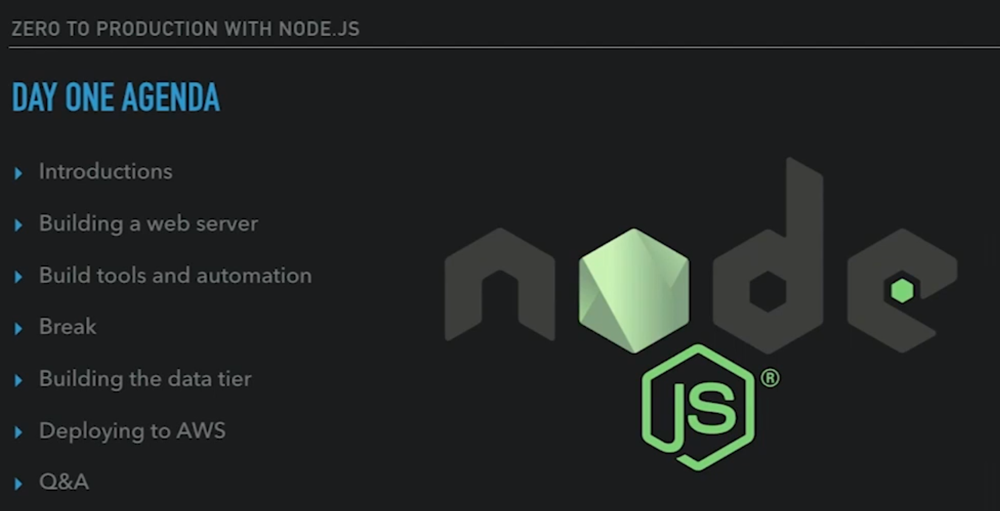
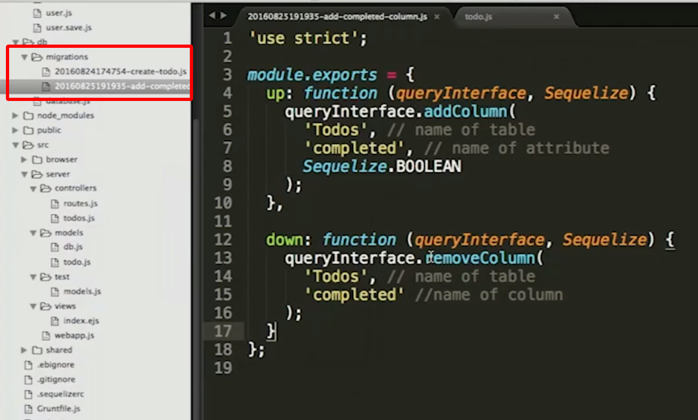

# Zero to Production Node.js on Amazon Web Services
## Kevin Whinnery

# The Web Server
- We're going to go through launching an example together on AWS.

- We're doing the course this way because writing the code is normal but launching it is not.
- There is no substitute for actually writing code and dealing with bugs.
- Our sample application is a To-Do List.
- We'll be using the Google Style Guide.
- **Grunt** is a general purpose task runner.
- I had to install `npm i grunt sequalize` as well to get it working.
- I also had to fix how the disk was mounted since it wasn't applying permissions correctly.
- Make sure to run `npm install` as that should install everything you need.
- Once done, run `grunt` to start the services.
- The first piece we're going to check out is **Express.js** webserver.
- It is excellent and forwarding http requests to chunks of Javascript code.
- Anything you want *Express* to do you will need to configure or install.
- It will execute a **Middleware** which is a fancy name for a javascript function.
- When calling `require()` in a js file, it will first try to look for the package in the node_modules folder in the current directory.
- Calling `.use()` is one way that you can 'define' middleware in the application.
```js
app.use((request, response, next) => {
    // next is a callback function.
    request.user = { name: "Kevin" };
    next();
});
```
- The difference between `let` and `var` is scoping impact.
- *Express* uses `.get()` when there is a get request from a client.
```js
app.get('/hello', (request, response) => {
  response.send('Hello ${request.user.name}');
});
```
- Typically, you wouldn't use the above and would have a module return the results of a constructor.
- There are other alternatives to Express - if you really wanted to check them out:
  * Hapi
  * Saills
  * Koa
- It is always best practive to use `npm install --save <package>` when you add a module to your project.


# Build Tools
- There are a lot of different choices for build tooling.
- The two Kevin likes the most are *npm scripts* and *grunt*.
- We will be using **Elastic Beanstalk** to push the code into production.
- *Beanstalk* cares about:
  * `start`: create the Node process for the instance.
  * `prestart`: run prior to start command
  * `poststart`: run after start command.
```js
"scripts": {
  "test": "NODE_ENV=test mocha src/server/test",
  "start": "node bin/server.js",
  "prestart": "sequelize db:migrate",
  "migrate": "sequelize db:migrate"
}
```
- **Grunt** allows you to import and run other modules and oversee them.
```js
// Load third party tasks
grunt.loadNpmTasks('grunt-sass');
grunt.loadNpmTasks('grunt-browserify');
grunt.loadNpmTasks('grunt-contrib-watch');
grunt.loadNpmTasks('grunt-nodemon');
grunt.loadNpmTasks('grunt-concurrent');
grunt.loadNpmTasks('grunt-shell');
grunt.loadNpmTasks('grunt-contrib-uglify');

// Default is running the local development server
grunt.registerTask('default', ['sass:dev', 'browserify', 'concurrent:dev']);

// Build production assets
grunt.registerTask('collect_static',
  ['init_static', 'sass:dist', 'browserify', 'uglify']);

// Custom tasks
grunt.loadTasks('bin/tasks');
```
- You can also build your own custom grunt tasks.
- Alternatives to *Grunt* is **Gulp** or **Webpack**.
- If you add commands to the `package.json` file then make sure that you use the call `npm run-script <declared-name>`.


# The Database
- Now we're going to look at how to use Node.js with a Relational Database.
- We're going to use Postgres since there are usecases where it will be useful even NoSQL contains json.
- if you're not calling sql directly via shell then you'll want to use `sequalize`.
- It's the most feature rich Node.js ORM.
- There are not a lot of tutorials or examples on the internet.
- The file `.sequalizerc` configures some of the important configuration options.
```js
// Set default configuration for Sequelize
const path = require('path');
module.exports = {
  config: path.resolve('db', 'database.js'),
  'migrations-path': path.resolve('db', 'migrations'),
  'models-path': path.resolve('src', 'server', 'models')
};
```
- The migration files are a record of the changes being made.
- They contain and `up` and `down` function for what is added and deleted.
- The other place you will find database information will be in the db.js file.
- It will contain a single instance of the sql object.
- You will need to configure the connection informatoin in `index.js` inside the config folder:
```js
config.databaseUrl = 'postgres://localhost:5432/todos';
config.databaseOptions = {
  dialect: 'postgres',
  logging: false,
  pool: {
    max: 5,
    min: 0,
    idle: 10000
  }
};
```
The models folder is where you define the different kinds of tables/models:
```js
'use strict';

const Sequelize = require('sequelize');
const db = require('./db');

let Todo = db.define('Todo', {
  title: Sequelize.TEXT,
  completed: Sequelize.BOOLEAN
});

module.exports = Todo;
```
- When you're going to create a new migration, then you'll want to run `sequalize migration:create`.
- In the `up` function, we want to add a column to the existing database.

- Once the database has been updated, you'll want to update the models.js file.


# Production Environment


# Front End Toolchain


# Vue.js


# Realtime User Interfaces


# Production Monitoring


# Web Analytics


# Research:
- Morgan middleware?


# Reference:
- [Github Repo](github.com/kwhinnery/todomvc-plusplus)
- [Sequalize Docs](http://docs.sequelizejs.com/manual/)
